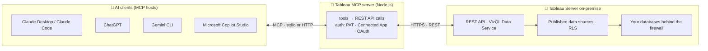

<div align="center">

🌐 **Language / ภาษา:** &nbsp; **🇺🇸 English** (this page) &nbsp;·&nbsp; [🇹🇭 ภาษาไทย → README.th.md](README.th.md)

</div>

<div align="center">

# 📊 Tableau Server On-Premise + Tableau MCP + AI

**Bilingual (🇺🇸 EN / 🇹🇭 TH) step-by-step guide — connect Tableau Server on-premise to Claude, ChatGPT, Gemini and Microsoft Copilot through the official Tableau MCP server, then wrap it in your own web portal with an AI chat box.**

[](#-navigate)
[](docs/en/01-overview.md)
[](README.th.md)

    

</div>

---

## 🧭 Navigate

| # | Section | What you get | 🇺🇸 EN | 🇹🇭 TH | ⏱️ |
|:-:|---|---|:-:|:-:|:-:|
| 1 | 📖 **Overview** | What Tableau MCP is, why on-premise, who this is for | [Read](docs/en/01-overview.md) | [อ่าน](docs/th/01-overview.md) | 3 min |
| 2 | 🏗️ **Architecture** | Component diagram, 3 auth options (PAT / Connected App / OAuth), 4 deployment patterns, security boundaries | [Read](docs/en/02-architecture.md) | [อ่าน](docs/th/02-architecture.md) | 5 min |
| 3 | ✅ **Prerequisites** | Version matrix, licensing, ports, permissions, OS, AI-client requirements | [Read](docs/en/03-prerequisites.md) | [อ่าน](docs/th/03-prerequisites.md) | 4 min |
| 4 | ⚙️ **Installation & configuration** | Prepare Tableau Server → run MCP (stdio / Docker / systemd / nginx) → connect Claude, ChatGPT, Gemini, Copilot → verify + troubleshooting table | [Read](docs/en/04-installation.md) | [อ่าน](docs/th/04-installation.md) | 6 min |
| 5 | 💡 **Top 5 use cases** | Find content → query data → executive summary → admin insights → agentic analysis | [Read](docs/en/05-use-cases.md) | [อ่าน](docs/th/05-use-cases.md) | 5 min |
| 6 | 🖥️ **Web UI wrapper** (advanced) | Node.js + Express + React portal that hides the server connection, with an AI chat box, embedded viz and audit log — full code | [Read](docs/en/06-web-ui-wrapper.md) | [อ่าน](docs/th/06-web-ui-wrapper.md) | 5 min |
| 7 | 🔐 **Permissions, roles, licences & APIs** | Site roles vs licences, capabilities each MCP tool needs (incl. **API Access**), RLS options, **Tableau API reference** (REST, VDS, Metadata, Connected Apps, Embedding…), **role capability matrix** for developers, security design + checklist | [Read](docs/en/07-permissions-security.md) | [อ่าน](docs/th/07-permissions-security.md) | 6 min |
| 8 | 📈 **Enterprise proposal** | Ready-to-adapt plan for IT: problem, vision, use cases by department with impact metrics, target architecture, 4-phase roadmap, team, cost structure, risks, decision | [Read](docs/en/08-enterprise-proposal.md) | [อ่าน](docs/th/08-enterprise-proposal.md) | 6 min |
| 9 | 🛡️ **Best practices & security** | Governance rules and a 14-point go-live checklist | [Read](docs/en/09-best-practices.md) | [อ่าน](docs/th/09-best-practices.md) | 3 min |
| 10 | ❓ **FAQ & glossary** | 10 common questions, EN/TH glossary | [Read](docs/en/10-faq-glossary.md) | [อ่าน](docs/th/10-faq-glossary.md) | 2 min |
| 11 | 🔗 **References** | Official Tableau, MCP and AI-vendor documentation links | [Read](docs/en/11-references.md) | [อ่าน](docs/th/11-references.md) | 1 min |

> [!TIP]
> Every page opens right here on GitHub. Each one has **Home · Previous · Next · language switch** links at the top and bottom, a collapsible table of contents, and copy buttons on every code block (GitHub adds them automatically).
>
> 🌐 Prefer the styled website version (sidebar, dark mode, reading progress)? It is the same content in `index.html`, `en/`, `th/` — open it locally or enable GitHub Pages (Settings → Pages → branch `main`, folder `/ (root)`) and it appears at `https://thenaritlab.github.io/tableau-mcp-server-on-premise-guide/`.

---

## 🗺️ How it fits together



The model never touches your database. Every data access is a tool call brokered by Tableau MCP and filtered by Tableau permissions and row-level security.

---

## 🖼️ What you will build (Section 6)


*A custom web portal that hides the Tableau Server connection: users sign in once, chat with an AI that queries Tableau through MCP, and see the matching dashboard embedded beside it. Full Node.js + Express + React code is in [Section 6](docs/en/06-web-ui-wrapper.md).*

---

## 🚀 Quick start (5 minutes, one laptop)

1. Create a Personal Access Token on Tableau Server (*My Account Settings › Personal Access Tokens*).
2. Add this to Claude Desktop's `claude_desktop_config.json` (or the equivalent for Gemini CLI / VS Code):

```json
{
  "mcpServers": {
    "tableau-demo": {
      "command": "npx",
      "args": ["-y", "@tableau/mcp-server@latest"],
      "env": {
        "SERVER": "https://demo-server.local",
        "SITE_NAME": "DemoSite",
        "PAT_NAME": "mcp-demo-pat",
        "PAT_VALUE": "<YOUR_PAT_VALUE>",
        "EXCLUDE_TOOLS": "pulse"
      }
    }
  }
}
```

3. Restart the client and ask **"List my Tableau data sources."**

> [!IMPORTANT]
> A PAT is for personal testing only. For anything shared, deploy over HTTP with **OAuth** (Tableau Server 2025.3+) so every query runs as the real user — see [Section 4](docs/en/04-installation.md).

---

## 🔐 Which authentication should I use?

| | 🔑 PAT | 🤝 Connected App (Direct Trust) | 👤 OAuth |
|---|---|---|---|
| Best for | Personal testing, stdio | Service identity, embedded portal | Shared multi-user HTTP deployment |
| Identity seen by Tableau | PAT owner | `JWT_SUB_CLAIM` user | The signed-in user |
| Concurrent users | ❌ | ✅ | ✅ |
| Tableau Server version | Any supported | Any supported | 2025.3+ |
| Row-level security | As PAT owner | As `sub` user | Per user, automatic ✅ |

---

## 🔐 Who can see what?

| Layer | Controlled by | What the AI inherits |
|---|---|---|
| 1 · Licence / site role | Viewer · Explorer · Creator | The ceiling — a Viewer can never download full data |
| 2 · Project | View project, 🔒 locked permissions | Invisible projects are never listed or queried |
| 3 · Content capabilities | Workbook: View, Filter, Download Summary/Full Data · Data source: View, Connect, **API Access** | `query-datasource` needs Connect + API Access (off by default); `get-view-data` needs Download Summary Data |
| 4 · Row-level security | Data-source filter, entitlement table, virtual connection policy | Same question, different rows per user — only if the MCP auth passes the real user |
| 5 · MCP scoping | `INCLUDE_TOOLS`, `INCLUDE_PROJECT_IDS`, `INCLUDE_TAGS` | An extra fence, never a substitute |

**Minimum role to query through the AI: Viewer** (with View + Connect + API Access on the data source). Full detail, the Tableau API reference table, a site-role capability matrix, permission templates for `ai-viewers` / `ai-analysts` / `ai-admins` and a security checklist in [Section 7](docs/en/07-permissions-security.md).

---

## 💡 The five use cases

| Level | Use case | Tools the AI calls |
|---|---|---|
| 🟢 Basic | Find and understand content | `search-content`, `list-datasources`, `list-fields` |
| 🟢 Basic | Ask a question of a data source | `query-datasource` |
| 🔵 Intermediate | Executive summary of a dashboard | `get-view-data`, `get-view-image` |
| 🔵 Intermediate | Admin insights and housekeeping | admin tool group, `list-extract-refresh-tasks` |
| 🟣 Advanced | Multi-step agentic analysis with lineage | all of the above + metadata / lineage |

---

## 💻 Run the website version locally

```bash
git clone https://github.com/thenaritlab/tableau-mcp-server-on-premise-guide.git
cd tableau-mcp-server-on-premise-guide
python3 -m http.server 8000      # then open http://localhost:8000
```

No build step — plain HTML, CSS and a small script. You can also just double-click `index.html`. The Markdown pages under `docs/` need nothing at all: they render on GitHub.

## 📁 Repository layout

```text
├── README.md           🇺🇸 English home (this page)
├── README.th.md        🇹🇭 Thai home
├── docs/
│   ├── en/             🇺🇸 11 Markdown pages, read on GitHub (01-overview … 11-references)
│   ├── th/             🇹🇭 11 Markdown pages, same order
│   └── assets/diagrams ✏️ SVG diagrams used by both languages
├── index.html          🌐 styled website version (optional, for GitHub Pages / local)
├── en/  th/  assets/   🌐 website pages, theme, script
```

> [!NOTE]
> Written against **Tableau MCP 3.6.x** and **Tableau Server 2025.3+** (September 2026). Fast-moving details (ChatGPT / Copilot connector screens, port env var) are marked *"verify with current docs"* inside the guide. All host names, tokens and company names are placeholders — nothing here points at a real environment.

## 🙌 Contributing

Found a step that changed in a newer Tableau MCP release? Open an issue or a pull request — edit the page under `docs/en/` or `docs/th/` and keep both languages in sync.

---

<div align="center">

🇺🇸 English (this page) · [🇹🇭 ภาษาไทย](README.th.md)

**Created by The Narit Lab**
Tableau · Data Analytics · AI-assisted BI

</div>
