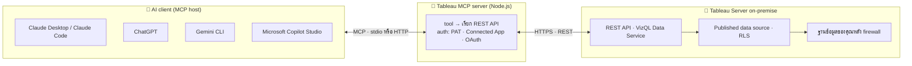
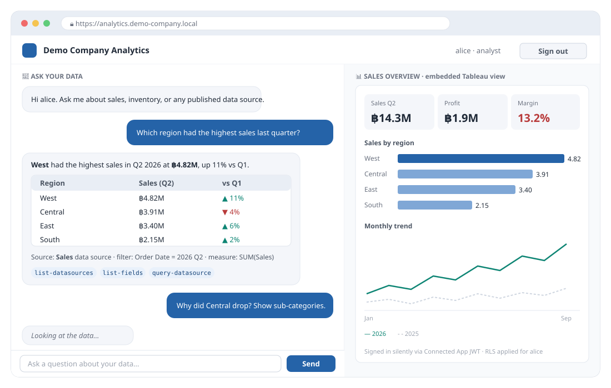

<div align="center">

🌐 **Language / ภาษา:** &nbsp; [🇺🇸 English → README.md](README.md) &nbsp;·&nbsp; **🇹🇭 ภาษาไทย** (หน้านี้)

</div>

<div align="center">

# 📊 Tableau Server On-Premise + Tableau MCP + AI

**คู่มือทีละขั้นตอน (🇹🇭 ไทย / 🇺🇸 อังกฤษ) — เชื่อม Tableau Server on-premise เข้ากับ Claude, ChatGPT, Gemini และ Microsoft Copilot ผ่าน Tableau MCP อย่างเป็นทางการ แล้วสร้างหน้าเว็บของคุณเองครอบไว้พร้อมช่องแชท AI**

[](#-สารบัญ)
[](docs/th/01-overview.md)
[](README.md)

    

</div>

---

## 🧭 สารบัญ

| # | ส่วน | เนื้อหา | 🇹🇭 ไทย | 🇺🇸 EN | ⏱️ |
|:-:|---|---|:-:|:-:|:-:|
| 1 | 📖 **ภาพรวม** | Tableau MCP คืออะไร ทำไมต้อง on-premise เหมาะกับใคร | [อ่าน](docs/th/01-overview.md) | [Read](docs/en/01-overview.md) | 3 นาที |
| 2 | 🏗️ **สถาปัตยกรรม** | แผนภาพองค์ประกอบ ทางเลือก auth 3 แบบ (PAT / Connected App / OAuth) รูปแบบติดตั้ง 4 แบบ ขอบเขตความปลอดภัย | [อ่าน](docs/th/02-architecture.md) | [Read](docs/en/02-architecture.md) | 5 นาที |
| 3 | ✅ **สิ่งที่ต้องเตรียม** | ตารางเวอร์ชัน ลิขสิทธิ์ พอร์ต สิทธิ์ OS และข้อกำหนดของ AI client | [อ่าน](docs/th/03-prerequisites.md) | [Read](docs/en/03-prerequisites.md) | 4 นาที |
| 4 | ⚙️ **การติดตั้งและตั้งค่า** | เตรียม Tableau Server → รัน MCP (stdio / Docker / systemd / nginx) → เชื่อม Claude, ChatGPT, Gemini, Copilot → ตรวจสอบ + ตารางแก้ปัญหา | [อ่าน](docs/th/04-installation.md) | [Read](docs/en/04-installation.md) | 6 นาที |
| 5 | 💡 **5 use case ยอดนิยม** | ค้นหาเนื้อหา → query ข้อมูล → สรุปผู้บริหาร → admin insight → วิเคราะห์แบบ agentic | [อ่าน](docs/th/05-use-cases.md) | [Read](docs/en/05-use-cases.md) | 5 นาที |
| 6 | 🖥️ **Web UI ครอบ Tableau Server** (ขั้นสูง) | portal Node.js + Express + React ที่ซ่อนการเชื่อมต่อ server พร้อมช่องแชท AI, dashboard ฝัง และ audit log — โค้ดครบ | [อ่าน](docs/th/06-web-ui-wrapper.md) | [Read](docs/en/06-web-ui-wrapper.md) | 5 นาที |
| 7 | 🔐 **สิทธิ์ บทบาท ลิขสิทธิ์ และ API** | site role กับลิขสิทธิ์, capability ที่ MCP tool แต่ละตัวต้องใช้ (รวม **API Access**), ทางเลือก RLS, **ตาราง API ของ Tableau** (REST, VDS, Metadata, Connected Apps, Embedding…), **ตารางเทียบ role** สำหรับนักพัฒนา, การออกแบบความปลอดภัย + checklist | [อ่าน](docs/th/07-permissions-security.md) | [Read](docs/en/07-permissions-security.md) | 6 นาที |
| 8 | 📈 **ข้อเสนอโครงการสำหรับองค์กร** | แผนสำหรับ IT ปรับใช้ได้ทันที: ปัญหา วิสัยทัศน์ use case รายแผนกพร้อมตัวชี้วัด สถาปัตยกรรมเป้าหมาย roadmap 4 เฟส ทีม โครงสร้างต้นทุน ความเสี่ยง การตัดสินใจ | [อ่าน](docs/th/08-enterprise-proposal.md) | [Read](docs/en/08-enterprise-proposal.md) | 6 นาที |
| 9 | 🛡️ **แนวปฏิบัติที่ดีและความปลอดภัย** | กฎการกำกับดูแลและ checklist ก่อน go-live 14 ข้อ | [อ่าน](docs/th/09-best-practices.md) | [Read](docs/en/09-best-practices.md) | 3 นาที |
| 10 | ❓ **คำถามที่พบบ่อยและอภิธานศัพท์** | คำถาม 10 ข้อ ศัพท์ ไทย/อังกฤษ | [อ่าน](docs/th/10-faq-glossary.md) | [Read](docs/en/10-faq-glossary.md) | 2 นาที |
| 11 | 🔗 **เอกสารอ้างอิง** | ลิงก์เอกสารทางการของ Tableau, MCP และผู้ให้บริการ AI | [อ่าน](docs/th/11-references.md) | [Read](docs/en/11-references.md) | 1 นาที |

> [!TIP]
> ทุกหน้าเปิดอ่านบน GitHub ได้เลย แต่ละหน้ามีลิงก์ **หน้าแรก · ก่อนหน้า · ถัดไป · สลับภาษา** ทั้งบนและล่าง มีสารบัญพับได้ และ code block ทุกอันมีปุ่มคัดลอก (GitHub ใส่ให้อัตโนมัติ)
>
> 🌐 อยากได้เวอร์ชันเว็บไซต์ (sidebar, dark mode, reading progress)? เนื้อหาเดียวกันอยู่ใน `index.html`, `en/`, `th/` — เปิดจากเครื่องได้ หรือเปิด GitHub Pages (Settings → Pages → branch `main`, folder `/ (root)`) จะขึ้นที่ `https://thenaritlab.github.io/tableau-mcp-server-on-premise-guide/`

---

## 🗺️ ภาพรวมการทำงาน



โมเดลไม่เคยแตะฐานข้อมูลของคุณ ทุกการเข้าถึงข้อมูลคือการเรียก tool ผ่าน Tableau MCP และถูกกรองด้วยสิทธิ์ของ Tableau และ row-level security

---

## 🖼️ สิ่งที่คุณจะได้สร้าง (ส่วนที่ 6)



*หน้าเว็บ portal ของคุณเองที่ซ่อนการเชื่อมต่อ Tableau Server: ผู้ใช้ล็อกอินครั้งเดียว แชทกับ AI ที่ query Tableau ผ่าน MCP และเห็น dashboard ที่เกี่ยวข้องฝังอยู่ข้างๆ โค้ด Node.js + Express + React ครบชุดอยู่ใน [ส่วนที่ 6](docs/th/06-web-ui-wrapper.md)*

---

## 🚀 เริ่มเร็ว (5 นาที บนโน้ตบุ๊กเครื่องเดียว)

1. สร้าง Personal Access Token บน Tableau Server (*My Account Settings › Personal Access Tokens*)
2. เพิ่มค่านี้ใน `claude_desktop_config.json` ของ Claude Desktop (หรือไฟล์เทียบเท่าของ Gemini CLI / VS Code):

```json
{
  "mcpServers": {
    "tableau-demo": {
      "command": "npx",
      "args": ["-y", "@tableau/mcp-server@latest"],
      "env": {
        "SERVER": "https://demo-server.local",
        "SITE_NAME": "DemoSite",
        "PAT_NAME": "mcp-demo-pat",
        "PAT_VALUE": "<YOUR_PAT_VALUE>",
        "EXCLUDE_TOOLS": "pulse"
      }
    }
  }
}
```

3. ปิดแล้วเปิด client ใหม่ แล้วถาม **"List my Tableau data sources."**

> [!IMPORTANT]
> PAT ใช้สำหรับทดสอบส่วนตัวเท่านั้น หากใช้ร่วมกันหลายคน ให้ติดตั้งแบบ HTTP พร้อม **OAuth** (Tableau Server 2025.3+) เพื่อให้ทุก query ทำงานในนามผู้ใช้จริง — ดู[ส่วนที่ 4](docs/th/04-installation.md)

---

## 🔐 ควรใช้ auth แบบไหน

| | 🔑 PAT | 🤝 Connected App (Direct Trust) | 👤 OAuth |
|---|---|---|---|
| เหมาะกับ | ทดสอบส่วนตัว, stdio | service identity, portal แบบฝัง | ติดตั้งแบบ HTTP ใช้ร่วมกันหลายคน |
| ตัวตนที่ Tableau เห็น | เจ้าของ PAT | ผู้ใช้ใน `JWT_SUB_CLAIM` | ผู้ใช้ที่ล็อกอิน |
| ใช้พร้อมกันหลายคน | ❌ | ✅ | ✅ |
| เวอร์ชัน Tableau Server | ที่ยัง support | ที่ยัง support | 2025.3+ |
| Row-level security | ตามเจ้าของ PAT | ตามผู้ใช้ `sub` | รายบุคคล อัตโนมัติ ✅ |

---

## 🔐 ใครเห็นอะไรได้บ้าง

| ชั้น | ควบคุมโดย | สิ่งที่ AI สืบทอด |
|---|---|---|
| 1 · ลิขสิทธิ์ / site role | Viewer · Explorer · Creator | เพดาน — Viewer ดาวน์โหลดข้อมูลเต็มไม่ได้เด็ดขาด |
| 2 · Project | View project, 🔒 locked permissions | project ที่มองไม่เห็นจะไม่ถูกแสดงหรือ query |
| 3 · Capability ของเนื้อหา | Workbook: View, Filter, Download Summary/Full Data · Data source: View, Connect, **API Access** | `query-datasource` ต้องมี Connect + API Access (ปิดโดยปริยาย); `get-view-data` ต้องมี Download Summary Data |
| 4 · Row-level security | filter ใน data source, ตาราง entitlement, virtual connection policy | คำถามเดียวกัน แถวต่างกันตามผู้ใช้ — เฉพาะเมื่อ MCP auth ส่งผู้ใช้จริง |
| 5 · ขอบเขต MCP | `INCLUDE_TOOLS`, `INCLUDE_PROJECT_IDS`, `INCLUDE_TAGS` | รั้วเพิ่มอีกชั้น ไม่ใช่สิ่งทดแทน |

**role ขั้นต่ำสำหรับ query ผ่าน AI: Viewer** (ต้องมี View + Connect + API Access บน data source) รายละเอียดเต็ม ตาราง API ของ Tableau ตารางเทียบ site role แม่แบบสิทธิ์ `ai-viewers` / `ai-analysts` / `ai-admins` และ checklist ความปลอดภัย อยู่ใน[ส่วนที่ 7](docs/th/07-permissions-security.md)

---

## 💡 5 use case

| ระดับ | Use case | tool ที่ AI เรียก |
|---|---|---|
| 🟢 พื้นฐาน | ค้นหาและทำความเข้าใจเนื้อหา | `search-content`, `list-datasources`, `list-fields` |
| 🟢 พื้นฐาน | ถามคำถามกับ data source | `query-datasource` |
| 🔵 ระดับกลาง | สรุปผู้บริหารจาก dashboard | `get-view-data`, `get-view-image` |
| 🔵 ระดับกลาง | Admin insight และงานดูแลระบบ | admin tool group, `list-extract-refresh-tasks` |
| 🟣 ขั้นสูง | วิเคราะห์หลายขั้นแบบ agentic พร้อม lineage | ทั้งหมดข้างต้น + metadata / lineage |

---

## 💻 รันเวอร์ชันเว็บไซต์บนเครื่อง

```bash
git clone https://github.com/thenaritlab/tableau-mcp-server-on-premise-guide.git
cd tableau-mcp-server-on-premise-guide
python3 -m http.server 8000      # แล้วเปิด http://localhost:8000
```

ไม่ต้อง build — เป็น HTML, CSS และสคริปต์เล็กๆ ดับเบิลคลิก `index.html` ก็ได้ ส่วนหน้า Markdown ใน `docs/` ไม่ต้องทำอะไรเลย GitHub render ให้

## 📁 โครงสร้าง repo

```text
├── README.md           🇺🇸 หน้าแรกภาษาอังกฤษ
├── README.th.md        🇹🇭 หน้าแรกภาษาไทย (หน้านี้)
├── docs/
│   ├── en/             🇺🇸 Markdown 11 หน้า อ่านบน GitHub (01-overview … 11-references)
│   ├── th/             🇹🇭 Markdown 11 หน้า ลำดับเดียวกัน
│   └── assets/diagrams ✏️ แผนภาพ SVG ที่ใช้ร่วมกันทั้งสองภาษา
├── index.html          🌐 เวอร์ชันเว็บไซต์ (ไม่บังคับ สำหรับ GitHub Pages / เปิดในเครื่อง)
├── en/  th/  assets/   🌐 หน้าเว็บ ธีม สคริปต์
```

> [!NOTE]
> เขียนอิงจาก **Tableau MCP 3.6.x** และ **Tableau Server 2025.3+** (กันยายน 2569) รายละเอียดที่เปลี่ยนบ่อย (หน้าจอ connector ของ ChatGPT / Copilot, ตัวแปรพอร์ต) มีกล่อง *"ตรวจสอบกับเอกสารล่าสุด"* กำกับไว้ในคู่มือ ชื่อเครื่อง โทเคน และชื่อบริษัททั้งหมดเป็นค่าตัวอย่าง ไม่ได้ชี้ไปยังระบบจริง

## 🙌 ร่วมปรับปรุง

พบขั้นตอนที่เปลี่ยนไปใน Tableau MCP เวอร์ชันใหม่? เปิด issue หรือ pull request ได้เลย — แก้หน้าใน `docs/en/` หรือ `docs/th/` และช่วยรักษาให้ทั้งสองภาษาตรงกัน

---

<div align="center">

[🇺🇸 English](README.md) · 🇹🇭 ภาษาไทย (หน้านี้)

**Created by The Narit Lab**
Tableau · Data Analytics · AI-assisted BI

</div>
