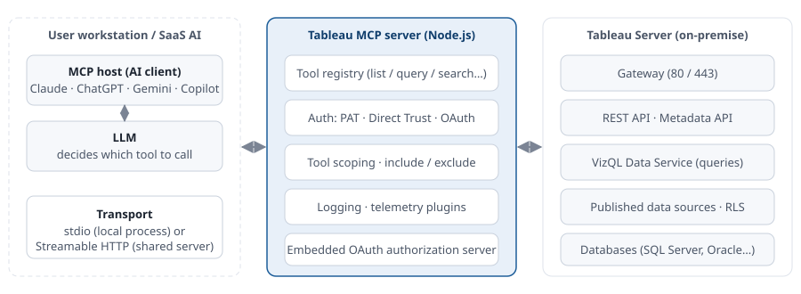
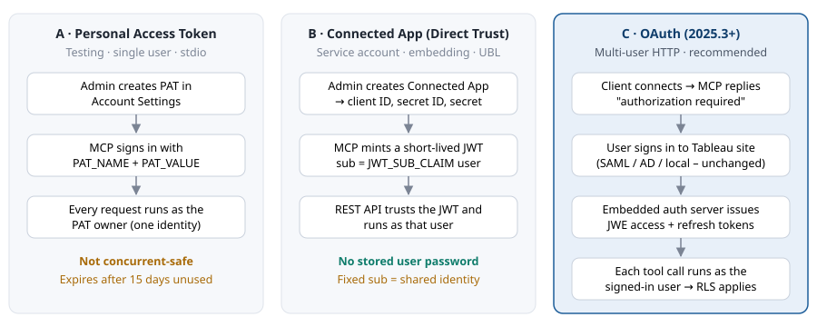
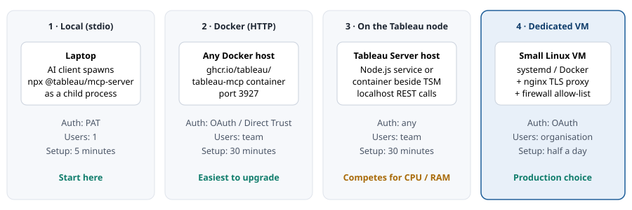

[🏠 Home](../../README.md) · [◀ Previous: Overview](01-overview.md) · [Next: Prerequisites ▶](03-prerequisites.md) · [🇹🇭 ภาษาไทย](../th/02-architecture.md)

---

# 🏗️ Architecture

`Section 2 of 9`

> Three components, two hops. The AI client talks MCP to the Tableau MCP server; the MCP server talks HTTPS to Tableau Server's REST API. Everything to the right of the MCP server is your existing on-premise estate.

## Component view

*Figure 1. Component view. The LLM never connects to Tableau Server directly; every data access is a tool call brokered by Tableau MCP.*

### What flows where

1. The user types a question in the AI client.
2. The LLM reads the tool list the MCP server advertised and decides, for example, to call `list-datasources` then `query-datasource`.
3. The MCP server converts each tool call to REST API / VDS requests, signed with the configured credential.
4. Tableau Server enforces permissions and RLS, runs the query, returns data.
5. The MCP server returns the tool result to the client; the LLM writes the answer.

> [!WARNING]
> **Data leaves the network at step 5**
>
> Tool results (metadata and query results) are sent to whichever LLM the client uses. If the model is a public SaaS API, that data leaves your network. Use tool scoping, RLS and a data classification policy to control what can be queried. For fully on-premise setups, point your custom front end (Section 6) at a self-hosted model.

## Authentication options

*Figure 2. The three ways Tableau MCP can sign in to Tableau Server. Choose C for anything shared between people.*

| | A · PAT | B · Connected App | C · OAuth |
|---|---|---|---|
| Best for | Personal testing, stdio | Service identity, embedded portal, licensed UBL | Shared HTTP deployment |
| Identity seen by Tableau | PAT owner | Value of `JWT_SUB_CLAIM` (or the OAuth user with `{OAUTH_USERNAME}`) | The user who signed in |
| Concurrency | Not safe | Yes | Yes |
| Tableau Server version | Any supported | Any supported | 2025.3 or newer |
| Extra setup | None | Create Connected App, enable it | RSA key + `tsm` redirect host |
| Row-level security | As PAT owner | As `sub` user | Per user, automatic |

## Deployment options

*Figure 3. Four deployment patterns. Most organisations start with 1 for a demo and move to 4 for production.*

### Network and security boundaries

- **Boundary 1 – client to MCP.** With stdio there is no network: the AI client launches the server as a child process on the same machine. With HTTP, bind the server to `127.0.0.1` and put a TLS reverse proxy with an IP allow-list in front of it. Never expose it to the internet, and never with OAuth disabled.
- **Boundary 2 – MCP to Tableau Server.** Standard HTTPS to the gateway (443). The MCP host needs a route to Tableau Server and must trust its TLS certificate (or you pass a CA bundle).
- **Boundary 3 – client to LLM.** Owned by the AI vendor (Anthropic, OpenAI, Google, Microsoft) or by you if self-hosting. Tool results cross this boundary.

> [!TIP]
> **Cloud-hosted AI clients need a reachable URL**
>
> ChatGPT and Copilot Studio run in the vendor's cloud and cannot reach `127.0.0.1`. For those clients you need option 2, 3 or 4 with a URL reachable from the internet (through your reverse proxy or a tunnel) and OAuth enabled. Claude Desktop, Claude Code and Gemini CLI run on your machine and work with stdio.

---

📚 Contents

1. 📖 [Overview](01-overview.md)
2. 🏗️ **[Architecture](02-architecture.md)**
3. ✅ [Prerequisites](03-prerequisites.md)
4. ⚙️ [Installation and configuration](04-installation.md)
5. 💡 [Top 5 use cases](05-use-cases.md)
6. 🖥️ [Advanced: build a custom Web UI wrapper](06-web-ui-wrapper.md)
7. 🛡️ [Best practices, governance and security checklist](07-best-practices.md)
8. ❓ [FAQ and glossary](08-faq-glossary.md)
9. 🔗 [References](09-references.md)

[🏠 Home](../../README.md) · [◀ Previous: Overview](01-overview.md) · [Next: Prerequisites ▶](03-prerequisites.md) · [🇹🇭 ภาษาไทย](../th/02-architecture.md)

Section 2 of 9 · Created by The Narit Lab
