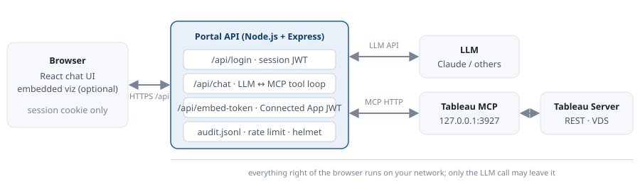

[🏠 Home](../../README.md) · [◀ Previous: Top 5 use cases](05-use-cases.md) · [Next: Best practices, governance and security checklist ▶](07-best-practices.md) · [🇹🇭 ภาษาไทย](../th/06-web-ui-wrapper.md)

---

# 🖥️ Advanced: build a custom Web UI wrapper

`Section 6 of 9`

> A "mask" in front of Tableau Server: users sign in to your portal, chat with an AI that queries Tableau through MCP, and optionally see embedded dashboards. They never learn the server URL, tokens or data source IDs, and every question is logged.

## Purpose

- **Hide connection details.** Server URL, PAT / Connected App secrets and the MCP endpoint live only in the portal's environment.
- **One sign-in.** The portal authenticates the user (demo: env users; production: your SSO / LDAP) and passes identity to the model as context.
- **Bring your own model.** The sample uses the Anthropic API; swapping in OpenAI, Gemini or a self-hosted model is a single function.
- **Audit.** Every chat turn writes who asked what, which tools ran, and how long it took.

## Reference architecture



*Figure 4. The portal is the only component with credentials. The browser sees a cookie; the model sees tool results.*

**Tech stack.** Node.js 22, Express 4, `@modelcontextprotocol/sdk` (MCP client), `@anthropic-ai/sdk`, React 18 with Vite, `jsonwebtoken` for sessions and the Connected App embed token, `helmet` and `express-rate-limit` for basic hardening.

**Why the portal talks to Tableau MCP over HTTP.** One MCP process serves many portal requests; the portal opens a short-lived MCP client per chat turn, lists tools, lets the model call them, and closes. Run Tableau MCP with Direct Trust (service identity) or OAuth + `AUTH=direct-trust` with `JWT_SUB_CLAIM={OAUTH_USERNAME}` when you want per-user RLS from the portal.

## Project layout

```text
tableau-ai-portal/
├── package.json
├── vite.config.js
├── index.html
├── .env                 ← secrets, never committed
├── logs/audit.jsonl     ← created at runtime
├── server/
│   └── server.js        ← Express API + LLM/MCP loop
└── src/
    ├── main.jsx
    ├── App.jsx          ← sign-in + chat box
    ├── styles.css
    └── EmbeddedView.jsx ← optional dashboard embed
```

## Step by step

1. **Run Tableau MCP in HTTP mode** — on the same host or an internal address, using the Direct Trust `.env` from Section 4.2 with `DANGEROUSLY_DISABLE_OAUTH=true` *only because* the portal is the sole client and the port is bound to localhost.
2. **Create the project**

**`wrapper/setup.sh`**

```bash
mkdir -p tableau-ai-portal/{server,src,logs} && cd tableau-ai-portal
# copy package.json, vite.config.js, index.html into ./ ; server.js into server/ ; App.jsx main.jsx styles.css into src/
cp .env.example .env      # then fill in the values
npm install
npm run dev               # UI: http://localhost:5173   API: http://localhost:8080
```

**`wrapper/package.json`**

```json
{
  "name": "tableau-ai-portal",
  "version": "1.0.0",
  "private": true,
  "type": "module",
  "scripts": {
    "dev": "concurrently \"node server/server.js\" \"vite\"",
    "build": "vite build",
    "start": "NODE_ENV=production node server/server.js"
  },
  "dependencies": {
    "@anthropic-ai/sdk": "^0.60.0",
    "@modelcontextprotocol/sdk": "^1.20.0",
    "cookie-parser": "^1.4.7",
    "dotenv": "^16.4.5",
    "express": "^4.21.0",
    "express-rate-limit": "^7.4.0",
    "helmet": "^8.0.0",
    "jsonwebtoken": "^9.0.2",
    "react": "^18.3.1",
    "react-dom": "^18.3.1"
  },
  "devDependencies": {
    "@vitejs/plugin-react": "^4.3.1",
    "concurrently": "^9.0.1",
    "vite": "^5.4.0"
  }
}
```

**`wrapper/.env.example`**

```text
# --- Portal ---
PORT=8080
SESSION_SECRET=<LONG_RANDOM_STRING>
ALLOWED_ORIGIN=http://localhost:5173

# --- Tableau MCP (running in HTTP mode, reachable only from this server) ---
MCP_URL=http://127.0.0.1:3927/tableau-mcp

# --- Tableau Server (used only for embedding views with a Connected App JWT) ---
TABLEAU_SERVER=https://demo-server.local
TABLEAU_SITE=DemoSite
CONNECTED_APP_CLIENT_ID=<CONNECTED_APP_CLIENT_ID>
CONNECTED_APP_SECRET_ID=<CONNECTED_APP_SECRET_ID>
CONNECTED_APP_SECRET_VALUE=<CONNECTED_APP_SECRET_VALUE>

# --- LLM provider ---
ANTHROPIC_API_KEY=<YOUR_ANTHROPIC_API_KEY>
LLM_MODEL=claude-sonnet-4-6

# --- Demo users (replace with your SSO / LDAP in production) ---
DEMO_USERS=alice:alice-pass:analyst,bob:bob-pass:manager
```

3. **Backend** — — the broker. Read the comments: sections 1–6 map to the boxes in Figure 4.

**`wrapper/server.js`**

```javascript
// server/server.js - the "mask" in front of Tableau Server.
// Browser  <->  this API  <->  Tableau MCP (HTTP)  <->  Tableau Server REST API
// Secrets never leave this process. The browser only ever sees a session cookie.
import "dotenv/config";
import express from "express";
import helmet from "helmet";
import cookieParser from "cookie-parser";
import rateLimit from "express-rate-limit";
import jwt from "jsonwebtoken";
import fs from "node:fs";
import path from "node:path";
import Anthropic from "@anthropic-ai/sdk";
import { Client } from "@modelcontextprotocol/sdk/client/index.js";
import { StreamableHTTPClientTransport } from "@modelcontextprotocol/sdk/client/streamableHttp.js";

const app = express();
app.use(helmet());
app.use(express.json({ limit: "1mb" }));
app.use(cookieParser());
app.use("/api/", rateLimit({ windowMs: 60_000, max: 60 }));

// ---------- 1. Authentication (demo: env users; production: SSO/LDAP) ----------
const users = Object.fromEntries(
  (process.env.DEMO_USERS || "").split(",").filter(Boolean).map((u) => {
    const [name, pass, role] = u.split(":");
    return [name, { pass, role }];
  })
);

function requireUser(req, res, next) {
  try {
    req.user = jwt.verify(req.cookies.session, process.env.SESSION_SECRET);
    next();
  } catch {
    res.status(401).json({ error: "Sign in first" });
  }
}

app.post("/api/login", (req, res) => {
  const { username, password } = req.body || {};
  const u = users[username];
  if (!u || u.pass !== password) return res.status(401).json({ error: "Wrong username or password" });
  const token = jwt.sign({ sub: username, role: u.role }, process.env.SESSION_SECRET, { expiresIn: "8h" });
  res.cookie("session", token, { httpOnly: true, sameSite: "lax", secure: process.env.NODE_ENV === "production" });
  res.json({ username, role: u.role });
});

app.post("/api/logout", (req, res) => { res.clearCookie("session"); res.json({ ok: true }); });
app.get("/api/me", requireUser, (req, res) => res.json({ username: req.user.sub, role: req.user.role }));

// ---------- 2. Audit log (append-only JSON lines) ----------
const auditFile = path.resolve("logs/audit.jsonl");
fs.mkdirSync(path.dirname(auditFile), { recursive: true });
function audit(event) {
  fs.appendFileSync(auditFile, JSON.stringify({ ts: new Date().toISOString(), ...event }) + "\n");
}

// ---------- 3. MCP client (one connection per request keeps it simple and safe) ----------
async function withMcp(fn) {
  const client = new Client({ name: "tableau-ai-portal", version: "1.0.0" });
  const transport = new StreamableHTTPClientTransport(new URL(process.env.MCP_URL));
  await client.connect(transport);
  try { return await fn(client); } finally { await client.close(); }
}

// Convert MCP tool definitions into the Anthropic tool format
function toAnthropicTools(mcpTools) {
  return mcpTools.map((t) => ({
    name: t.name,
    description: t.description || "",
    input_schema: t.inputSchema || { type: "object", properties: {} },
  }));
}

// ---------- 4. Chat endpoint: LLM <-> MCP tool loop ----------
const anthropic = new Anthropic();
const SYSTEM_PROMPT = `You are a data assistant for Demo Company. You can only answer using the Tableau tools provided.
Rules: (1) Start by listing or searching data sources when unsure which one to use. (2) Never invent numbers.
(3) When you query data, say which data source and fields you used. (4) Keep answers short and business-friendly.
(5) Do not reveal server URLs, tokens, or internal IDs to the user.`;

app.post("/api/chat", requireUser, async (req, res) => {
  const { messages } = req.body; // [{role:'user'|'assistant', content:string}]
  if (!Array.isArray(messages) || !messages.length) return res.status(400).json({ error: "messages[] required" });

  const started = Date.now();
  const toolCalls = [];
  try {
    const reply = await withMcp(async (mcp) => {
      const { tools } = await mcp.listTools();
      const anthropicTools = toAnthropicTools(tools);
      let convo = messages.map((m) => ({ role: m.role, content: m.content }));

      // Agentic loop: let the model call tools until it produces a final text answer (max 8 rounds)
      for (let round = 0; round < 8; round++) {
        const resp = await anthropic.messages.create({
          model: process.env.LLM_MODEL,
          max_tokens: 2000,
          system: SYSTEM_PROMPT + `\nCurrent user: ${req.user.sub} (role: ${req.user.role}).`,
          tools: anthropicTools,
          messages: convo,
        });

        const toolUses = resp.content.filter((b) => b.type === "tool_use");
        if (resp.stop_reason !== "tool_use" || !toolUses.length) {
          return resp.content.filter((b) => b.type === "text").map((b) => b.text).join("\n");
        }

        convo.push({ role: "assistant", content: resp.content });
        const results = [];
        for (const tu of toolUses) {
          const r = await mcp.callTool({ name: tu.name, arguments: tu.input });
          const text = (r.content || []).map((c) => (c.type === "text" ? c.text : "")).join("\n");
          toolCalls.push({ tool: tu.name, args: tu.input, ok: !r.isError });
          results.push({ type: "tool_result", tool_use_id: tu.id, content: text.slice(0, 50_000), is_error: !!r.isError });
        }
        convo.push({ role: "user", content: results });
      }
      return "I could not finish that in a reasonable number of steps. Try a narrower question.";
    });

    audit({ user: req.user.sub, role: req.user.role, question: messages.at(-1).content, toolCalls, ms: Date.now() - started });
    res.json({ reply, toolCalls: toolCalls.map((t) => t.tool) });
  } catch (err) {
    audit({ user: req.user.sub, error: String(err.message), ms: Date.now() - started });
    res.status(500).json({ error: "The assistant could not reach the data service. Try again or contact the BI team." });
  }
});

// ---------- 5. Embedded view token (Connected App / Direct Trust JWT) ----------
app.get("/api/embed-token", requireUser, (req, res) => {
  const token = jwt.sign(
    { iss: process.env.CONNECTED_APP_CLIENT_ID, sub: req.user.sub, aud: "tableau", jti: crypto.randomUUID(),
      scp: ["tableau:views:embed"] },
    process.env.CONNECTED_APP_SECRET_VALUE,
    { algorithm: "HS256", expiresIn: "5m",
      header: { kid: process.env.CONNECTED_APP_SECRET_ID, iss: process.env.CONNECTED_APP_CLIENT_ID } }
  );
  res.json({ token, server: process.env.TABLEAU_SERVER, site: process.env.TABLEAU_SITE });
});

// ---------- 6. Serve the built React app in production ----------
if (process.env.NODE_ENV === "production") {
  app.use(express.static("dist"));
  app.get("*", (_req, res) => res.sendFile(path.resolve("dist/index.html")));
}

app.listen(process.env.PORT || 8080, () => console.log(`Portal listening on :${process.env.PORT || 8080}`));
```

4. **Front end** — — sign-in gate and chat box.

**`wrapper/index.html`**

```html
<!-- index.html (project root, used by Vite) -->
<!DOCTYPE html>
<html lang="en">
<head><meta charset="utf-8"><meta name="viewport" content="width=device-width,initial-scale=1"><title>Demo Company Analytics</title></head>
<body><div id="root"></div><script type="module" src="/src/main.jsx"></script></body>
</html>
```

**`wrapper/vite.config.js`**

```javascript
// vite.config.js - dev server proxies /api to Express so cookies work on one origin
import { defineConfig } from "vite";
import react from "@vitejs/plugin-react";
export default defineConfig({
  plugins: [react()],
  server: { port: 5173, proxy: { "/api": "http://localhost:8080" } },
});
```

**`wrapper/main.jsx`**

```jsx
// src/main.jsx
import React from "react";
import { createRoot } from "react-dom/client";
import App from "./App.jsx";
import "./styles.css";
createRoot(document.getElementById("root")).render(<App />);
```

**`wrapper/App.jsx`**

```jsx
// src/App.jsx - sign-in gate + AI chat box. The browser never sees Tableau credentials.
import { useEffect, useRef, useState } from "react";

const api = (path, opts = {}) =>
  fetch(`/api${path}`, { credentials: "include", headers: { "Content-Type": "application/json" }, ...opts })
    .then(async (r) => { const j = await r.json(); if (!r.ok) throw new Error(j.error || r.statusText); return j; });

export default function App() {
  const [me, setMe] = useState(null);
  useEffect(() => { api("/me").then(setMe).catch(() => setMe(null)); }, []);
  if (me === null) return <Login onDone={setMe} />;
  return <Portal me={me} onLogout={() => api("/logout", { method: "POST" }).then(() => setMe(null))} />;
}

function Login({ onDone }) {
  const [u, setU] = useState(""); const [p, setP] = useState(""); const [err, setErr] = useState("");
  const submit = () => api("/login", { method: "POST", body: JSON.stringify({ username: u, password: p }) })
    .then(onDone).catch((e) => setErr(e.message));
  return (
    <div className="login">
      <h1>Demo Company Analytics</h1>
      <input placeholder="Username" value={u} onChange={(e) => setU(e.target.value)} />
      <input placeholder="Password" type="password" value={p} onChange={(e) => setP(e.target.value)}
             onKeyDown={(e) => e.key === "Enter" && submit()} />
      {err && <p className="err">{err}</p>}
      <button onClick={submit}>Sign in</button>
    </div>
  );
}

function Portal({ me, onLogout }) {
  const [msgs, setMsgs] = useState([{ role: "assistant", content: `Hi ${me.username}. Ask me about sales, inventory, or any published data source.` }]);
  const [input, setInput] = useState(""); const [busy, setBusy] = useState(false);
  const bottom = useRef(null);
  useEffect(() => bottom.current?.scrollIntoView({ behavior: "smooth" }), [msgs]);

  const send = async () => {
    const q = input.trim(); if (!q || busy) return;
    const next = [...msgs, { role: "user", content: q }];
    setMsgs(next); setInput(""); setBusy(true);
    try {
      const { reply, toolCalls } = await api("/chat", { method: "POST", body: JSON.stringify({ messages: next.filter((m) => m.role !== "system") }) });
      setMsgs([...next, { role: "assistant", content: reply, tools: toolCalls }]);
    } catch (e) {
      setMsgs([...next, { role: "assistant", content: e.message, error: true }]);
    } finally { setBusy(false); }
  };

  return (
    <div className="portal">
      <header>
        <strong>Demo Company Analytics</strong>
        <span>{me.username} · {me.role}</span>
        <button onClick={onLogout}>Sign out</button>
      </header>
      <section className="chat">
        {msgs.map((m, i) => (
          <div key={i} className={`bubble ${m.role} ${m.error ? "error" : ""}`}>
            <div className="text">{m.content}</div>
            {m.tools?.length > 0 && <div className="tools">used: {m.tools.join(", ")}</div>}
          </div>
        ))}
        {busy && <div className="bubble assistant typing">Looking at the data…</div>}
        <div ref={bottom} />
      </section>
      <footer className="composer">
        <input value={input} onChange={(e) => setInput(e.target.value)} placeholder="e.g. Which region had the highest sales last quarter?"
               onKeyDown={(e) => e.key === "Enter" && send()} disabled={busy} />
        <button onClick={send} disabled={busy || !input.trim()}>Send</button>
      </footer>
    </div>
  );
}
```

**`wrapper/styles.css`**

```css
/* src/styles.css */
:root{font-family:"IBM Plex Sans","IBM Plex Sans Thai",system-ui,sans-serif;color:#1c2430;background:#f6f8fb}
body{margin:0}
.login{max-width:360px;margin:12vh auto;padding:32px;background:#fff;border:1px solid #dfe4ec;border-radius:12px;display:flex;flex-direction:column;gap:12px}
.login h1{font-size:1.4rem;margin:0 0 8px}
input{padding:10px 12px;border:1px solid #c9d1dc;border-radius:6px;font:inherit}
button{padding:10px 16px;border:0;border-radius:6px;background:#1c5d99;color:#fff;font:inherit;font-weight:600;cursor:pointer}
button:disabled{opacity:.5;cursor:default}
.err{color:#b13b3b;margin:0}
.portal{display:flex;flex-direction:column;height:100vh;max-width:900px;margin:0 auto;background:#fff;border-left:1px solid #dfe4ec;border-right:1px solid #dfe4ec}
.portal header{display:flex;align-items:center;gap:16px;padding:14px 20px;border-bottom:1px solid #dfe4ec}
.portal header span{margin-left:auto;color:#7b8494;font-size:14px}
.chat{flex:1;overflow-y:auto;padding:20px;display:flex;flex-direction:column;gap:12px}
.bubble{max-width:78%;padding:12px 16px;border-radius:14px;line-height:1.55;white-space:pre-wrap}
.bubble.user{align-self:flex-end;background:#1c5d99;color:#fff;border-bottom-right-radius:4px}
.bubble.assistant{align-self:flex-start;background:#f6f8fb;border:1px solid #dfe4ec;border-bottom-left-radius:4px}
.bubble.error{background:#fbe9e9;border-color:#b13b3b}
.bubble.typing{color:#7b8494;font-style:italic}
.tools{margin-top:8px;font-size:12px;color:#7b8494;font-family:ui-monospace,monospace}
.composer{display:flex;gap:10px;padding:14px 20px;border-top:1px solid #dfe4ec}
.composer input{flex:1}
```

5. **Optional: embed a dashboard** — next to the chat, signed in silently with the Connected App JWT minted by `/api/embed-token`. The Connected App needs the scope `tableau:views:embed`.

**`wrapper/embed-view.jsx`**

```jsx
// src/EmbeddedView.jsx - optional: show a Tableau dashboard next to the chat, signed in silently via Connected App
import { useEffect, useState } from "react";

export default function EmbeddedView({ viewPath }) {   // e.g. "SalesOverview/Dashboard"
  const [cfg, setCfg] = useState(null);
  useEffect(() => {
    fetch("/api/embed-token", { credentials: "include" }).then((r) => r.json()).then(setCfg);
  }, []);
  useEffect(() => {
    if (!cfg || document.getElementById("tab-embed")) return;
    const s = document.createElement("script");
    s.id = "tab-embed"; s.type = "module";
    s.src = `${cfg.server}/javascripts/api/tableau.embedding.3.latest.min.js`;
    document.head.appendChild(s);
  }, [cfg]);
  if (!cfg) return <p>Loading dashboard…</p>;
  return (
    <tableau-viz id="viz" src={`${cfg.server}/t/${cfg.site}/views/${viewPath}`} token={cfg.token}
                 toolbar="hidden" hide-tabs style={{ width: "100%", height: "600px" }} />
  );
}
```

6. **Run it** — `npm run dev`, open `http://localhost:5173`, sign in as `alice / alice-pass`, ask *"Which region had the highest sales last quarter?"*. Watch `logs/audit.jsonl` fill up.
7. **Production** — `npm run build` then `npm start` behind the same nginx used for Tableau MCP, with `NODE_ENV=production` so cookies are `Secure`.

### Swapping the model

`/api/chat` only depends on three things: a tool list, a "call the model" function and a "call the tool" function. To use OpenAI, replace `anthropic.messages.create` with `openai.chat.completions.create` and map `tools` to the `function` format; for Gemini use `functionDeclarations`; for a self-hosted model use any OpenAI-compatible endpoint. Keep the loop and the audit code unchanged.

## Security considerations

| Area | What the sample does | What to add for production |
|---|---|---|
| Secrets | `.env` on the server only; browser gets an httpOnly cookie | Vault / Key Vault; rotate the Connected App secret; separate secrets per environment |
| User identity | Demo users from `DEMO_USERS` | SSO (SAML / OIDC) or LDAP; map groups to roles |
| Row-level security | Model is told the user and role; Tableau enforces RLS for the MCP identity | Run Tableau MCP with OAuth + `JWT_SUB_CLAIM={OAUTH_USERNAME}` or mint a per-user Direct Trust JWT so RLS applies to the real user, not the service account |
| Tool surface | Whatever Tableau MCP exposes | `INCLUDE_TOOLS=datasource` plus `INCLUDE_DATASOURCE_IDS` for the portal's MCP instance |
| Prompt injection | System prompt forbids revealing internals | Strip URLs/IDs from tool results before sending to the model; never let the model call write tools from the portal |
| Audit logging | `audit.jsonl` with user, question, tools, latency | Ship to your SIEM; add request IDs that correlate with Tableau MCP `fileLogger` output |
| Rate limiting and abuse | 60 requests/minute per IP | Per-user quotas; token budgets per day |
| Data residency | LLM call leaves the network | Self-hosted or regional model endpoint; data classification tags in `INCLUDE_TAGS` |
| Transport | HTTP in dev | TLS everywhere; `Secure`, `SameSite=Strict` cookies; CSP via helmet |

> [!WARNING]
> **Never expose the MCP port through the portal**
>
> The browser must call only `/api/*`. If you proxy `/tableau-mcp` to the front end you have removed the mask.

---

<details>
<summary>📚 Contents</summary>

1. 📖 [Overview](01-overview.md)
2. 🏗️ [Architecture](02-architecture.md)
3. ✅ [Prerequisites](03-prerequisites.md)
4. ⚙️ [Installation and configuration](04-installation.md)
5. 💡 [Top 5 use cases](05-use-cases.md)
6. 🖥️ **[Advanced: build a custom Web UI wrapper](06-web-ui-wrapper.md)**
7. 🛡️ [Best practices, governance and security checklist](07-best-practices.md)
8. ❓ [FAQ and glossary](08-faq-glossary.md)
9. 🔗 [References](09-references.md)

</details>

[🏠 Home](../../README.md) · [◀ Previous: Top 5 use cases](05-use-cases.md) · [Next: Best practices, governance and security checklist ▶](07-best-practices.md) · [🇹🇭 ภาษาไทย](../th/06-web-ui-wrapper.md)

<sub>Section 6 of 9 · Created by The Narit Lab</sub>
