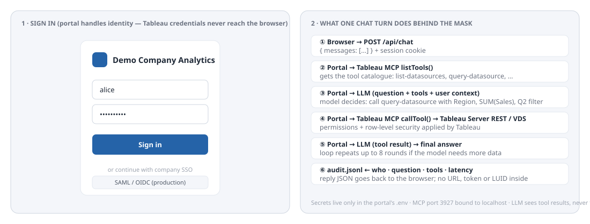

[🏠 หน้าแรก](../../README.th.md) · [◀ ก่อนหน้า: 5 use case ยอดนิยม](05-use-cases.md) · [ถัดไป: แนวปฏิบัติที่ดี การกำกับดูแล และรายการตรวจสอบความปลอดภัย ▶](07-best-practices.md) · [🇺🇸 English](../en/06-web-ui-wrapper.md)

---

# 🖥️ ขั้นสูง: สร้าง Web UI ครอบ Tableau Server

`ส่วนที่ 6 จาก 9`

> "หน้ากาก" ที่วางไว้หน้า Tableau Server: ผู้ใช้ล็อกอินเข้า portal ของคุณ แชทกับ AI ที่ query Tableau ผ่าน MCP และเห็น dashboard แบบฝังได้ตามต้องการ ผู้ใช้ไม่มีทางรู้ URL ของ server, โทเคน หรือ ID ของ data source และทุกคำถามถูกบันทึก

## 🎯 วัตถุประสงค์

- **ซ่อนรายละเอียดการเชื่อมต่อ** URL ของ server, secret ของ PAT / Connected App และ endpoint ของ MCP อยู่เฉพาะใน environment ของ portal
- **ล็อกอินครั้งเดียว** portal ยืนยันตัวตนผู้ใช้ (เดโม: ผู้ใช้จาก env; production: SSO / LDAP ของคุณ) แล้วส่งตัวตนให้โมเดลเป็นบริบท
- **เลือกโมเดลได้เอง** ตัวอย่างใช้ Anthropic API การเปลี่ยนเป็น OpenAI, Gemini หรือโมเดลที่โฮสต์เองแก้แค่ฟังก์ชันเดียว
- **ตรวจสอบย้อนหลังได้** ทุกรอบแชทบันทึกว่าใครถามอะไร tool ไหนถูกเรียก และใช้เวลาเท่าไร

## 🖼️ หน้าตาของ portal เมื่อเสร็จแล้ว


*รูปที่ 4 portal ขณะใช้งาน: ช่องแชทด้านซ้าย (คำตอบระบุ data source และตัวกรอง พร้อมแสดงว่า MCP tool ใดถูกเรียก) และ dashboard ของ Tableau ฝังอยู่ด้านขวา ล็อกอินเงียบๆ ในนามผู้ใช้คนเดียวกัน*



*รูปที่ 5 หน้าล็อกอิน และ 6 สิ่งที่เกิดขึ้นหลังหน้ากากในการแชทหนึ่งรอบ*

## 🧩 สถาปัตยกรรมอ้างอิง


*รูปที่ 6 portal เป็นองค์ประกอบเดียวที่ถือข้อมูลรับรอง เบราว์เซอร์เห็นแค่ cookie โมเดลเห็นแค่ผลลัพธ์ของ tool*

**Tech stack** Node.js 22, Express 4, `@modelcontextprotocol/sdk` (MCP client), `@anthropic-ai/sdk`, React 18 กับ Vite, `jsonwebtoken` สำหรับ session และ embed token ของ Connected App, `helmet` และ `express-rate-limit` สำหรับความปลอดภัยขั้นพื้นฐาน

**ทำไม portal คุยกับ Tableau MCP ผ่าน HTTP** MCP โปรเซสเดียวรองรับคำขอจาก portal ได้หลายรายการ portal เปิด MCP client อายุสั้นต่อหนึ่งรอบแชท แสดงรายการ tool ให้โมเดลเรียก แล้วปิด รัน Tableau MCP ด้วย Direct Trust (service identity) หรือ OAuth + `AUTH=direct-trust` กับ `JWT_SUB_CLAIM={OAUTH_USERNAME}` เมื่อต้องการ RLS รายบุคคลจาก portal

## 📁 โครงสร้างโปรเจกต์

```text
tableau-ai-portal/
├── package.json
├── vite.config.js
├── index.html
├── .env                 ← secret ห้าม commit
├── logs/audit.jsonl     ← สร้างตอนรัน
├── server/
│   └── server.js        ← Express API + วงจร LLM/MCP
└── src/
    ├── main.jsx
    ├── App.jsx          ← หน้าล็อกอิน + ช่องแชท
    ├── styles.css
    └── EmbeddedView.jsx ← ฝัง dashboard (ไม่บังคับ)
```

## 👣 ทีละขั้นตอน

1. **รัน Tableau MCP ในโหมด HTTP** — บนเครื่องเดียวกันหรือ address ภายใน ใช้ `.env` แบบ Direct Trust จากส่วน 4.2 พร้อม `DANGEROUSLY_DISABLE_OAUTH=true` *ได้เฉพาะเพราะ* portal เป็น client เดียวและพอร์ต bind กับ localhost
2. **สร้างโปรเจกต์**

**`wrapper/setup.sh`**

```bash
mkdir -p tableau-ai-portal/{server,src,logs} && cd tableau-ai-portal
# copy package.json, vite.config.js, index.html into ./ ; server.js into server/ ; App.jsx main.jsx styles.css into src/
cp .env.example .env      # then fill in the values
npm install
npm run dev               # UI: http://localhost:5173   API: http://localhost:8080
```

**`wrapper/package.json`**

```json
{
  "name": "tableau-ai-portal",
  "version": "1.0.0",
  "private": true,
  "type": "module",
  "scripts": {
    "dev": "concurrently \"node server/server.js\" \"vite\"",
    "build": "vite build",
    "start": "NODE_ENV=production node server/server.js"
  },
  "dependencies": {
    "@anthropic-ai/sdk": "^0.60.0",
    "@modelcontextprotocol/sdk": "^1.20.0",
    "cookie-parser": "^1.4.7",
    "dotenv": "^16.4.5",
    "express": "^4.21.0",
    "express-rate-limit": "^7.4.0",
    "helmet": "^8.0.0",
    "jsonwebtoken": "^9.0.2",
    "react": "^18.3.1",
    "react-dom": "^18.3.1"
  },
  "devDependencies": {
    "@vitejs/plugin-react": "^4.3.1",
    "concurrently": "^9.0.1",
    "vite": "^5.4.0"
  }
}
```

**`wrapper/.env.example`**

```text
# --- Portal ---
PORT=8080
SESSION_SECRET=<LONG_RANDOM_STRING>
ALLOWED_ORIGIN=http://localhost:5173

# --- Tableau MCP (running in HTTP mode, reachable only from this server) ---
MCP_URL=http://127.0.0.1:3927/tableau-mcp

# --- Tableau Server (used only for embedding views with a Connected App JWT) ---
TABLEAU_SERVER=https://demo-server.local
TABLEAU_SITE=DemoSite
CONNECTED_APP_CLIENT_ID=<CONNECTED_APP_CLIENT_ID>
CONNECTED_APP_SECRET_ID=<CONNECTED_APP_SECRET_ID>
CONNECTED_APP_SECRET_VALUE=<CONNECTED_APP_SECRET_VALUE>

# --- LLM provider ---
ANTHROPIC_API_KEY=<YOUR_ANTHROPIC_API_KEY>
LLM_MODEL=claude-sonnet-4-6

# --- Demo users (replace with your SSO / LDAP in production) ---
DEMO_USERS=alice:alice-pass:analyst,bob:bob-pass:manager
```

3. **Backend** — — ตัวกลาง อ่านคอมเมนต์ในโค้ด: ส่วนที่ 1–6 ตรงกับกล่องในรูปที่ 6

**`wrapper/server.js`**

```javascript
// server/server.js - the "mask" in front of Tableau Server.
// Browser  <->  this API  <->  Tableau MCP (HTTP)  <->  Tableau Server REST API
// Secrets never leave this process. The browser only ever sees a session cookie.
import "dotenv/config";
import express from "express";
import helmet from "helmet";
import cookieParser from "cookie-parser";
import rateLimit from "express-rate-limit";
import jwt from "jsonwebtoken";
import fs from "node:fs";
import path from "node:path";
import Anthropic from "@anthropic-ai/sdk";
import { Client } from "@modelcontextprotocol/sdk/client/index.js";
import { StreamableHTTPClientTransport } from "@modelcontextprotocol/sdk/client/streamableHttp.js";

const app = express();
app.use(helmet());
app.use(express.json({ limit: "1mb" }));
app.use(cookieParser());
app.use("/api/", rateLimit({ windowMs: 60_000, max: 60 }));

// ---------- 1. Authentication (demo: env users; production: SSO/LDAP) ----------
const users = Object.fromEntries(
  (process.env.DEMO_USERS || "").split(",").filter(Boolean).map((u) => {
    const [name, pass, role] = u.split(":");
    return [name, { pass, role }];
  })
);

function requireUser(req, res, next) {
  try {
    req.user = jwt.verify(req.cookies.session, process.env.SESSION_SECRET);
    next();
  } catch {
    res.status(401).json({ error: "Sign in first" });
  }
}

app.post("/api/login", (req, res) => {
  const { username, password } = req.body || {};
  const u = users[username];
  if (!u || u.pass !== password) return res.status(401).json({ error: "Wrong username or password" });
  const token = jwt.sign({ sub: username, role: u.role }, process.env.SESSION_SECRET, { expiresIn: "8h" });
  res.cookie("session", token, { httpOnly: true, sameSite: "lax", secure: process.env.NODE_ENV === "production" });
  res.json({ username, role: u.role });
});

app.post("/api/logout", (req, res) => { res.clearCookie("session"); res.json({ ok: true }); });
app.get("/api/me", requireUser, (req, res) => res.json({ username: req.user.sub, role: req.user.role }));

// ---------- 2. Audit log (append-only JSON lines) ----------
const auditFile = path.resolve("logs/audit.jsonl");
fs.mkdirSync(path.dirname(auditFile), { recursive: true });
function audit(event) {
  fs.appendFileSync(auditFile, JSON.stringify({ ts: new Date().toISOString(), ...event }) + "\n");
}

// ---------- 3. MCP client (one connection per request keeps it simple and safe) ----------
async function withMcp(fn) {
  const client = new Client({ name: "tableau-ai-portal", version: "1.0.0" });
  const transport = new StreamableHTTPClientTransport(new URL(process.env.MCP_URL));
  await client.connect(transport);
  try { return await fn(client); } finally { await client.close(); }
}

// Convert MCP tool definitions into the Anthropic tool format
function toAnthropicTools(mcpTools) {
  return mcpTools.map((t) => ({
    name: t.name,
    description: t.description || "",
    input_schema: t.inputSchema || { type: "object", properties: {} },
  }));
}

// ---------- 4. Chat endpoint: LLM <-> MCP tool loop ----------
const anthropic = new Anthropic();
const SYSTEM_PROMPT = `You are a data assistant for Demo Company. You can only answer using the Tableau tools provided.
Rules: (1) Start by listing or searching data sources when unsure which one to use. (2) Never invent numbers.
(3) When you query data, say which data source and fields you used. (4) Keep answers short and business-friendly.
(5) Do not reveal server URLs, tokens, or internal IDs to the user.`;

app.post("/api/chat", requireUser, async (req, res) => {
  const { messages } = req.body; // [{role:'user'|'assistant', content:string}]
  if (!Array.isArray(messages) || !messages.length) return res.status(400).json({ error: "messages[] required" });

  const started = Date.now();
  const toolCalls = [];
  try {
    const reply = await withMcp(async (mcp) => {
      const { tools } = await mcp.listTools();
      const anthropicTools = toAnthropicTools(tools);
      let convo = messages.map((m) => ({ role: m.role, content: m.content }));

      // Agentic loop: let the model call tools until it produces a final text answer (max 8 rounds)
      for (let round = 0; round < 8; round++) {
        const resp = await anthropic.messages.create({
          model: process.env.LLM_MODEL,
          max_tokens: 2000,
          system: SYSTEM_PROMPT + `\nCurrent user: ${req.user.sub} (role: ${req.user.role}).`,
          tools: anthropicTools,
          messages: convo,
        });

        const toolUses = resp.content.filter((b) => b.type === "tool_use");
        if (resp.stop_reason !== "tool_use" || !toolUses.length) {
          return resp.content.filter((b) => b.type === "text").map((b) => b.text).join("\n");
        }

        convo.push({ role: "assistant", content: resp.content });
        const results = [];
        for (const tu of toolUses) {
          const r = await mcp.callTool({ name: tu.name, arguments: tu.input });
          const text = (r.content || []).map((c) => (c.type === "text" ? c.text : "")).join("\n");
          toolCalls.push({ tool: tu.name, args: tu.input, ok: !r.isError });
          results.push({ type: "tool_result", tool_use_id: tu.id, content: text.slice(0, 50_000), is_error: !!r.isError });
        }
        convo.push({ role: "user", content: results });
      }
      return "I could not finish that in a reasonable number of steps. Try a narrower question.";
    });

    audit({ user: req.user.sub, role: req.user.role, question: messages.at(-1).content, toolCalls, ms: Date.now() - started });
    res.json({ reply, toolCalls: toolCalls.map((t) => t.tool) });
  } catch (err) {
    audit({ user: req.user.sub, error: String(err.message), ms: Date.now() - started });
    res.status(500).json({ error: "The assistant could not reach the data service. Try again or contact the BI team." });
  }
});

// ---------- 5. Embedded view token (Connected App / Direct Trust JWT) ----------
app.get("/api/embed-token", requireUser, (req, res) => {
  const token = jwt.sign(
    { iss: process.env.CONNECTED_APP_CLIENT_ID, sub: req.user.sub, aud: "tableau", jti: crypto.randomUUID(),
      scp: ["tableau:views:embed"] },
    process.env.CONNECTED_APP_SECRET_VALUE,
    { algorithm: "HS256", expiresIn: "5m",
      header: { kid: process.env.CONNECTED_APP_SECRET_ID, iss: process.env.CONNECTED_APP_CLIENT_ID } }
  );
  res.json({ token, server: process.env.TABLEAU_SERVER, site: process.env.TABLEAU_SITE });
});

// ---------- 6. Serve the built React app in production ----------
if (process.env.NODE_ENV === "production") {
  app.use(express.static("dist"));
  app.get("*", (_req, res) => res.sendFile(path.resolve("dist/index.html")));
}

app.listen(process.env.PORT || 8080, () => console.log(`Portal listening on :${process.env.PORT || 8080}`));
```

4. **Front end** — — หน้าล็อกอินและช่องแชท

**`wrapper/index.html`**

```html
<!-- index.html (project root, used by Vite) -->
<!DOCTYPE html>
<html lang="en">
<head><meta charset="utf-8"><meta name="viewport" content="width=device-width,initial-scale=1"><title>Demo Company Analytics</title></head>
<body><div id="root"></div><script type="module" src="/src/main.jsx"></script></body>
</html>
```

**`wrapper/vite.config.js`**

```javascript
// vite.config.js - dev server proxies /api to Express so cookies work on one origin
import { defineConfig } from "vite";
import react from "@vitejs/plugin-react";
export default defineConfig({
  plugins: [react()],
  server: { port: 5173, proxy: { "/api": "http://localhost:8080" } },
});
```

**`wrapper/main.jsx`**

```jsx
// src/main.jsx
import React from "react";
import { createRoot } from "react-dom/client";
import App from "./App.jsx";
import "./styles.css";
createRoot(document.getElementById("root")).render(<App />);
```

**`wrapper/App.jsx`**

```jsx
// src/App.jsx - sign-in gate + AI chat box. The browser never sees Tableau credentials.
import { useEffect, useRef, useState } from "react";

const api = (path, opts = {}) =>
  fetch(`/api${path}`, { credentials: "include", headers: { "Content-Type": "application/json" }, ...opts })
    .then(async (r) => { const j = await r.json(); if (!r.ok) throw new Error(j.error || r.statusText); return j; });

export default function App() {
  const [me, setMe] = useState(null);
  useEffect(() => { api("/me").then(setMe).catch(() => setMe(null)); }, []);
  if (me === null) return <Login onDone={setMe} />;
  return <Portal me={me} onLogout={() => api("/logout", { method: "POST" }).then(() => setMe(null))} />;
}

function Login({ onDone }) {
  const [u, setU] = useState(""); const [p, setP] = useState(""); const [err, setErr] = useState("");
  const submit = () => api("/login", { method: "POST", body: JSON.stringify({ username: u, password: p }) })
    .then(onDone).catch((e) => setErr(e.message));
  return (
    <div className="login">
      <h1>Demo Company Analytics</h1>
      <input placeholder="Username" value={u} onChange={(e) => setU(e.target.value)} />
      <input placeholder="Password" type="password" value={p} onChange={(e) => setP(e.target.value)}
             onKeyDown={(e) => e.key === "Enter" && submit()} />
      {err && <p className="err">{err}</p>}
      <button onClick={submit}>Sign in</button>
    </div>
  );
}

function Portal({ me, onLogout }) {
  const [msgs, setMsgs] = useState([{ role: "assistant", content: `Hi ${me.username}. Ask me about sales, inventory, or any published data source.` }]);
  const [input, setInput] = useState(""); const [busy, setBusy] = useState(false);
  const bottom = useRef(null);
  useEffect(() => bottom.current?.scrollIntoView({ behavior: "smooth" }), [msgs]);

  const send = async () => {
    const q = input.trim(); if (!q || busy) return;
    const next = [...msgs, { role: "user", content: q }];
    setMsgs(next); setInput(""); setBusy(true);
    try {
      const { reply, toolCalls } = await api("/chat", { method: "POST", body: JSON.stringify({ messages: next.filter((m) => m.role !== "system") }) });
      setMsgs([...next, { role: "assistant", content: reply, tools: toolCalls }]);
    } catch (e) {
      setMsgs([...next, { role: "assistant", content: e.message, error: true }]);
    } finally { setBusy(false); }
  };

  return (
    <div className="portal">
      <header>
        <strong>Demo Company Analytics</strong>
        <span>{me.username} · {me.role}</span>
        <button onClick={onLogout}>Sign out</button>
      </header>
      <section className="chat">
        {msgs.map((m, i) => (
          <div key={i} className={`bubble ${m.role} ${m.error ? "error" : ""}`}>
            <div className="text">{m.content}</div>
            {m.tools?.length > 0 && <div className="tools">used: {m.tools.join(", ")}</div>}
          </div>
        ))}
        {busy && <div className="bubble assistant typing">Looking at the data…</div>}
        <div ref={bottom} />
      </section>
      <footer className="composer">
        <input value={input} onChange={(e) => setInput(e.target.value)} placeholder="e.g. Which region had the highest sales last quarter?"
               onKeyDown={(e) => e.key === "Enter" && send()} disabled={busy} />
        <button onClick={send} disabled={busy || !input.trim()}>Send</button>
      </footer>
    </div>
  );
}
```

**`wrapper/styles.css`**

```css
/* src/styles.css */
:root{font-family:"IBM Plex Sans","IBM Plex Sans Thai",system-ui,sans-serif;color:#1c2430;background:#f6f8fb}
body{margin:0}
.login{max-width:360px;margin:12vh auto;padding:32px;background:#fff;border:1px solid #dfe4ec;border-radius:12px;display:flex;flex-direction:column;gap:12px}
.login h1{font-size:1.4rem;margin:0 0 8px}
input{padding:10px 12px;border:1px solid #c9d1dc;border-radius:6px;font:inherit}
button{padding:10px 16px;border:0;border-radius:6px;background:#1c5d99;color:#fff;font:inherit;font-weight:600;cursor:pointer}
button:disabled{opacity:.5;cursor:default}
.err{color:#b13b3b;margin:0}
.portal{display:flex;flex-direction:column;height:100vh;max-width:900px;margin:0 auto;background:#fff;border-left:1px solid #dfe4ec;border-right:1px solid #dfe4ec}
.portal header{display:flex;align-items:center;gap:16px;padding:14px 20px;border-bottom:1px solid #dfe4ec}
.portal header span{margin-left:auto;color:#7b8494;font-size:14px}
.chat{flex:1;overflow-y:auto;padding:20px;display:flex;flex-direction:column;gap:12px}
.bubble{max-width:78%;padding:12px 16px;border-radius:14px;line-height:1.55;white-space:pre-wrap}
.bubble.user{align-self:flex-end;background:#1c5d99;color:#fff;border-bottom-right-radius:4px}
.bubble.assistant{align-self:flex-start;background:#f6f8fb;border:1px solid #dfe4ec;border-bottom-left-radius:4px}
.bubble.error{background:#fbe9e9;border-color:#b13b3b}
.bubble.typing{color:#7b8494;font-style:italic}
.tools{margin-top:8px;font-size:12px;color:#7b8494;font-family:ui-monospace,monospace}
.composer{display:flex;gap:10px;padding:14px 20px;border-top:1px solid #dfe4ec}
.composer input{flex:1}
```

5. **ไม่บังคับ: ฝัง dashboard** — ข้างช่องแชท ล็อกอินเงียบๆ ด้วย JWT ของ Connected App ที่ `/api/embed-token` สร้างให้ Connected App ต้องมี scope `tableau:views:embed`

**`wrapper/embed-view.jsx`**

```jsx
// src/EmbeddedView.jsx - optional: show a Tableau dashboard next to the chat, signed in silently via Connected App
import { useEffect, useState } from "react";

export default function EmbeddedView({ viewPath }) {   // e.g. "SalesOverview/Dashboard"
  const [cfg, setCfg] = useState(null);
  useEffect(() => {
    fetch("/api/embed-token", { credentials: "include" }).then((r) => r.json()).then(setCfg);
  }, []);
  useEffect(() => {
    if (!cfg || document.getElementById("tab-embed")) return;
    const s = document.createElement("script");
    s.id = "tab-embed"; s.type = "module";
    s.src = `${cfg.server}/javascripts/api/tableau.embedding.3.latest.min.js`;
    document.head.appendChild(s);
  }, [cfg]);
  if (!cfg) return <p>Loading dashboard…</p>;
  return (
    <tableau-viz id="viz" src={`${cfg.server}/t/${cfg.site}/views/${viewPath}`} token={cfg.token}
                 toolbar="hidden" hide-tabs style={{ width: "100%", height: "600px" }} />
  );
}
```

6. **รัน** — `npm run dev` เปิด `http://localhost:5173` ล็อกอินด้วย `alice / alice-pass` ถาม *"Which region had the highest sales last quarter?"* แล้วดู `logs/audit.jsonl` เพิ่มขึ้น
7. **Production** — `npm run build` แล้ว `npm start` หลัง nginx ตัวเดียวกับที่ใช้กับ Tableau MCP ตั้ง `NODE_ENV=production` เพื่อให้ cookie เป็น `Secure`

### เปลี่ยนโมเดล

`/api/chat` พึ่งพาแค่สามอย่าง: รายการ tool, ฟังก์ชัน "เรียกโมเดล" และฟังก์ชัน "เรียก tool" หากใช้ OpenAI ให้แทน `anthropic.messages.create` ด้วย `openai.chat.completions.create` และแปลง `tools` เป็นรูปแบบ `function` สำหรับ Gemini ใช้ `functionDeclarations` สำหรับโมเดลที่โฮสต์เองใช้ endpoint ที่เข้ากันได้กับ OpenAI ใดก็ได้ ส่วนวงจรและโค้ด audit ไม่ต้องแก้

## 🔒 ข้อพิจารณาด้านความปลอดภัย

| ด้าน | ตัวอย่างทำอะไร | ต้องเพิ่มอะไรสำหรับ production |
|---|---|---|
| Secret | `.env` บน server เท่านั้น เบราว์เซอร์ได้ httpOnly cookie | Vault / Key Vault; หมุนเวียน secret ของ Connected App; แยก secret ตาม environment |
| ตัวตนผู้ใช้ | ผู้ใช้เดโมจาก `DEMO_USERS` | SSO (SAML / OIDC) หรือ LDAP; map กลุ่มเป็น role |
| Row-level security | โมเดลรู้ผู้ใช้และ role; Tableau บังคับ RLS ตามตัวตนของ MCP | รัน Tableau MCP ด้วย OAuth + `JWT_SUB_CLAIM={OAUTH_USERNAME}` หรือสร้าง Direct Trust JWT รายบุคคล เพื่อให้ RLS ใช้กับผู้ใช้จริง ไม่ใช่ service account |
| ขอบเขต tool | ตามที่ Tableau MCP เปิด | `INCLUDE_TOOLS=datasource` บวก `INCLUDE_DATASOURCE_IDS` สำหรับ MCP instance ของ portal |
| Prompt injection | system prompt ห้ามเปิดเผยข้อมูลภายใน | ตัด URL/ID ออกจากผลลัพธ์ tool ก่อนส่งให้โมเดล; ห้ามให้โมเดลเรียก tool ที่เขียนข้อมูลจาก portal |
| Audit log | `audit.jsonl` มีผู้ใช้ คำถาม tool เวลา | ส่งเข้า SIEM; เพิ่ม request ID ที่เชื่อมกับ output ของ `fileLogger` ใน Tableau MCP |
| จำกัดอัตราและการใช้ผิด | 60 คำขอ/นาที ต่อ IP | โควตารายผู้ใช้; งบ token รายวัน |
| ถิ่นที่อยู่ของข้อมูล | การเรียก LLM ออกจากเครือข่าย | โมเดลโฮสต์เองหรือ endpoint ตามภูมิภาค; ใช้ tag จัดชั้นข้อมูลใน `INCLUDE_TAGS` |
| Transport | HTTP ตอนพัฒนา | TLS ทุกจุด; cookie `Secure`, `SameSite=Strict`; CSP ผ่าน helmet |

> [!WARNING]
> **ห้ามเปิดพอร์ต MCP ผ่าน portal เด็ดขาด**
>
> เบราว์เซอร์ต้องเรียกเฉพาะ `/api/*` หาก proxy `/tableau-mcp` ไปหน้าเว็บ เท่ากับถอดหน้ากากออกแล้ว

---

<details>
<summary>📚 สารบัญ</summary>

1. 📖 [ภาพรวม](01-overview.md)
2. 🏗️ [สถาปัตยกรรม](02-architecture.md)
3. ✅ [สิ่งที่ต้องเตรียม](03-prerequisites.md)
4. ⚙️ [การติดตั้งและตั้งค่า](04-installation.md)
5. 💡 [5 use case ยอดนิยม](05-use-cases.md)
6. 🖥️ **[ขั้นสูง: สร้าง Web UI ครอบ Tableau Server](06-web-ui-wrapper.md)**
7. 🛡️ [แนวปฏิบัติที่ดี การกำกับดูแล และรายการตรวจสอบความปลอดภัย](07-best-practices.md)
8. ❓ [คำถามที่พบบ่อยและอภิธานศัพท์](08-faq-glossary.md)
9. 🔗 [เอกสารอ้างอิง](09-references.md)

</details>

[🏠 หน้าแรก](../../README.th.md) · [◀ ก่อนหน้า: 5 use case ยอดนิยม](05-use-cases.md) · [ถัดไป: แนวปฏิบัติที่ดี การกำกับดูแล และรายการตรวจสอบความปลอดภัย ▶](07-best-practices.md) · [🇺🇸 English](../en/06-web-ui-wrapper.md)

<sub>ส่วนที่ 6 จาก 9 · Created by The Narit Lab</sub>
