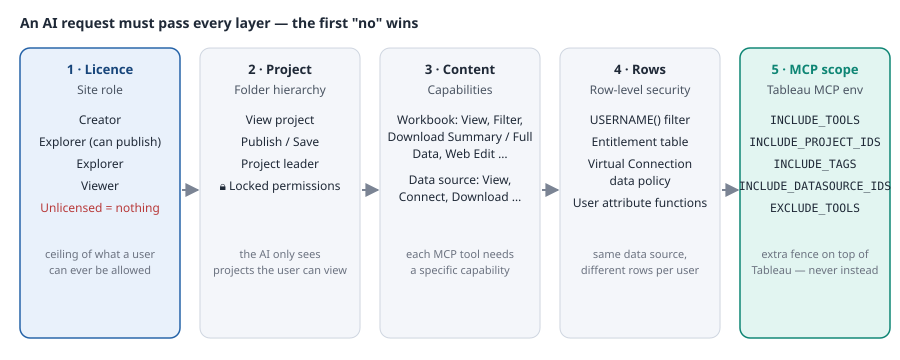

[🏠 หน้าแรก](../../README.th.md) · [◀ ก่อนหน้า: ขั้นสูง: สร้าง Web UI ครอบ Tableau Server](06-web-ui-wrapper.md) · [ถัดไป: ข้อเสนอโครงการ: แพลตฟอร์ม BI + AI Chat สำหรับองค์กรบน Tableau MCP ▶](08-enterprise-proposal.md) · [🇺🇸 English](../en/07-permissions-security.md)

---

# 🔐 สิทธิ์ บทบาท และลิขสิทธิ์

`ส่วนที่ 7 จาก 11`

> Tableau MCP ไม่มีระบบความปลอดภัยของตัวเอง แต่สืบทอดจาก Tableau ทั้งหมด นี่คือจุดแข็งที่สุด แต่จะได้ประโยชน์ก็ต่อเมื่อคุณเข้าใจว่าลิขสิทธิ์ site role สิทธิ์ระดับ project ความสามารถ (capability) ระดับเนื้อหา และ row-level security ซ้อนกันอย่างไร และ MCP tool แต่ละตัวต้องใช้ capability อะไรจริงๆ

## 🧱 ห้าชั้นของการควบคุม



*รูปที่ 1 ห้าชั้นระหว่างคำถามของ AI กับข้อมูลหนึ่งแถว Tableau บังคับใช้ชั้น 1–4 ส่วน Tableau MCP เพิ่มชั้นที่ 5 เป็นรั้วอีกชั้น*

## 🪪 ชั้นที่ 1 – ลิขสิทธิ์และ site role

ประเภทลิขสิทธิ์คือสิ่งที่คุณซื้อ ส่วน **site role** คือสิ่งที่ผู้ดูแลกำหนดให้ผู้ใช้บน site แต่ละแห่ง ภายในขอบเขตของลิขสิทธิ์ site role คือ *เพดาน*: สิทธิ์ใดๆ ไม่สามารถให้มากกว่าที่ role อนุญาต

| Site role | ลิขสิทธิ์ | ดูเนื้อหา | query published data source ผ่าน AI (View + Connect + API Access) | ดาวน์โหลดข้อมูลเต็ม | publish / web edit | ตัวตน AI ที่มักใช้ |
|---|---|---|---|---|---|---|
| Viewer | Viewer | ✅ | ✅ ถ้าได้รับสิทธิ์ | ❌ (เฉพาะสรุป) | ❌ | ผู้จัดการถามผ่าน portal |
| Explorer | Explorer | ✅ | ✅ | ✅ ถ้าได้รับสิทธิ์ | web edit ได้ publish ไม่ได้ | นักวิเคราะห์ใช้ Claude / Gemini สำรวจข้อมูล |
| Explorer (can publish) | Explorer | ✅ | ✅ | ✅ | ✅ | power user ที่สร้าง certified source |
| Creator | Creator | ✅ | ✅ | ✅ | ✅ + Desktop / Prep | ทีมข้อมูล, service identity ของ MCP สำหรับงาน admin |
| Site Administrator Explorer / Creator | Explorer / Creator | ✅ ทั้งหมด | ✅ | ✅ | ✅ | รัน admin tool group (stale content, refresh task) |
| Server Administrator | Creator | ✅ ทุกอย่าง ทุก site | ✅ | ✅ | ✅ | **ห้าม**ใช้เป็นตัวตนของ MCP เด็ดขาด |
| Unlicensed | — | ❌ | ❌ | ❌ | ❌ | AI ไม่ได้อะไรเลย sign-in ล้มเหลว |

> [!NOTE]
> **Viewer คือ role ขั้นต่ำ — สิ่งที่มักติดคือ API Access**
>
> Viewer ถือ *View*, *Connect* และ *API Access* บน published data source ได้ ซึ่งครบทุกอย่างที่ `query-datasource` ต้องการ *API Access* เป็น capability แยกที่**ปิดอยู่โดยปริยาย** เจ้าของหรือ project leader ต้องเปิดให้ สิ่งที่ Viewer ทำไม่ได้คือดาวน์โหลดข้อมูลเต็ม web edit และเชื่อมจาก Tableau Desktop ตรวจสัญญาลิขสิทธิ์ก่อนพึ่งพา Viewer สำหรับการ query ผ่าน AI แบบหนัก
>
> แหล่งอ้างอิง: Tableau Help › VizQL Data Service › Configuration ("To query a data source with VDS, you must first assign the API Access capability"); Permission Capabilities and Templates

> [!IMPORTANT]
> **ตรวจสอบกับเอกสารล่าสุด**
>
> ชื่อ site role และสิ่งที่อนุญาตค่อนข้างนิ่งแต่ไม่ตายตัว Tableau เคยปรับความสามารถของ Viewer มาแล้ว ตรวจกับหน้า "Site roles and permissions" ของเวอร์ชัน server ที่ใช้

## 📁 ชั้นที่ 2 – Project

Project คือโฟลเดอร์ที่เนื้อหาอยู่ การตั้งค่าสองอย่างสำคัญที่สุดสำหรับการเข้าถึงของ AI:

- **View project** – ถ้าผู้ใช้มองไม่เห็น project AI ก็แสดงรายการหรือ query อะไรข้างในไม่ได้ `search-content` และ `list-datasources` จะข้ามไปเงียบๆ
- **Locked permissions (Content Permissions › Locked)** – ทุกรายการสืบทอดกฎสิทธิ์ของ project และเจ้าของแก้ทับไม่ได้ นี่คือการตั้งค่าที่ทำให้ project "AI-ready" เชื่อถือได้: สิ่งที่ทีมข้อมูล certify จะถูกล็อกไว้ตามที่ตั้งเสมอ

โครงสร้างที่แนะนำ:

```text
📁 Certified (locked)            ← published data source สำหรับ AI + dashboard; ทีมข้อมูลเท่านั้นที่ publish
   📁 Sales
   📁 Finance                    ← เฉพาะกลุ่ม finance
   📁 HR (restricted)            ← เฉพาะกลุ่ม HR, บังคับ RLS
📁 Departmental (locked)         ← workbook ของทีมที่สร้างบน certified source
📁 Sandbox (customizable)        ← สำรวจส่วนตัว; อยู่นอกขอบเขต MCP
📁 Admin                         ← รายงาน admin, server admin เท่านั้น
```

## 🔑 ชั้นที่ 3 – Capability ระดับเนื้อหา

สิทธิ์กำหนดให้ **กลุ่ม** (แนะนำ) หรือผู้ใช้ เป็น *Allowed / Denied / Unspecified* ต่อ capability Denied ชนะ Allowed เสมอ ส่วน Unspecified จะถอยไปใช้กฎถัดไปและสุดท้ายคือ "ไม่ได้"

### Capability ของ workbook

| Capability | อนุญาตให้ | MCP tool ที่ต้องใช้ |
|---|---|---|
| View | เห็น workbook และ view | `list-workbooks`, `list-views`, `get-workbook` |
| Filter | เปลี่ยน filter และ parameter | `get-view-data` พร้อม filter, `get-view-image` พร้อม filter |
| Download Image/PDF | export ภาพ view | `get-view-image` |
| Download Summary Data | ข้อมูลรวมเบื้องหลัง view | `get-view-data` (summary) |
| Download Full Data | ข้อมูลระดับแถวเบื้องหลัง view | `get-view-data` เมื่อโมเดลขอข้อมูลดิบ |
| API Access + Full Data Query (FDQ) | ให้ API หรือ agent query ข้อมูลของ workbook แทนผู้ใช้; FDQ บังคับ user filter เฉพาะเมื่อเป็น data source filter | query data source ของ *workbook* ผ่าน VDS; Tableau Agent ใน dashboard |
| Web Edit, Download Workbook, Overwrite, Move, Delete, Set Permissions | แก้ไขและดูแล | AI แบบอ่านอย่างเดียวไม่ใช้ — deny ให้กลุ่ม AI |

### Capability ของ data source

| Capability | อนุญาตให้ | MCP tool ที่ต้องใช้ |
|---|---|---|
| View | เห็น data source ในรายการ | `list-datasources`, `search-content` |
| Connect | เชื่อมต่อได้ (Desktop, web authoring และเป็น source ต้นทางของ workbook ที่ VDS query) | `list-fields`, `get-datasource-metadata`, `query-datasource` |
| **API Access** | query แบบ programmatic ผ่าน **VizQL Data Service** — ปิดโดยปริยาย | `query-datasource` (จำเป็น), `get-datasource-metadata` ผ่าน VDS |
| Create Metric Definitions | สร้าง Tableau Pulse metric บนมัน (Cloud) | tool ของ Pulse (Cloud เท่านั้น) |
| Download Data Source / Save a Copy | ได้ไฟล์ .tdsx | ไม่จำเป็น — deny ให้กลุ่ม AI |
| Overwrite, Delete, Set Permissions | ดูแล | deny ให้กลุ่ม AI |
| (Extract refresh: เจ้าของหรือ project leader) | สั่ง / ตั้งเวลา refresh | `list-extract-refresh-tasks`, tool refresh — เฉพาะ instance ของ admin |

### แม่แบบสิทธิ์สำหรับกลุ่ม AI

| กลุ่ม | วัตถุประสงค์ | Workbook | Data source | Site role |
|---|---|---|---|---|
| `ai-viewers` | ถามคำถามผ่าน portal | View, Filter, Download Summary Data | View, Connect, API Access | Viewer |
| `ai-analysts` | สำรวจด้วย Claude / Gemini / VS Code | + Download Full Data, Download Image | View, Connect, API Access | Explorer |
| `ai-admins` | งานดูแลระบบด้วย admin tool group | ทั้งหมด | ทั้งหมด | Site Administrator Explorer |
| `svc-mcp-portal` (service) | ตัวตน Direct Trust ของ portal | View, Filter, Download Summary Data | View, Connect, API Access | Viewer หรือ Explorer |

ตั้งค่าเหล่านี้บน project *Certified* โดยล็อกสิทธิ์ แล้วทั้ง tree จะตามไปเอง

## 🔒 ชั้นที่ 4 – Row-level security

Capability ตัดสินว่าผู้ใช้ query data source ได้*หรือไม่* RLS ตัดสินว่าได้*แถวไหน* Tableau ใช้ RLS ตามตัวตนที่ MCP server ล็อกอิน ดังนั้นโหมด auth จากบทสถาปัตยกรรมจึงสำคัญ:

| MCP auth | ตัวตนที่ Tableau เห็น | ผลของ RLS |
|---|---|---|
| OAuth | ผู้ใช้จริง | ✅ ถูกต้องรายบุคคล |
| Direct Trust กับ `JWT_SUB_CLAIM={OAUTH_USERNAME}` (รูปแบบ portal) | ผู้ใช้จริง | ✅ ถูกต้องรายบุคคล |
| Direct Trust กับ `JWT_SUB_CLAIM` คงที่ | service user หนึ่งคน | ⚠️ ทุกคนได้แถวของ service user |
| PAT | เจ้าของ PAT | ⚠️ ทุกคนได้แถวของเจ้าของ |

สี่วิธีทำ RLS บน Tableau Server จากง่ายสุดถึงขยายได้มากสุด:

1. **User filter ใน workbook** – `USERNAME()` หรือ `ISMEMBEROF('group')` ใน calculated filter เร็ว แต่อยู่ในแต่ละ workbook; AI ที่ query *data source* โดยตรงจะข้ามมันไป ใช้ได้เฉพาะ use case ที่อิง view
2. **Calculated filter ใน published data source** – ฟังก์ชันเดียวกัน แต่ใส่ที่ data source ทำให้ทุก workbook *และ* ทุกการเรียก `query-datasource` สืบทอดไปด้วย นี่คือขั้นต่ำสำหรับ AI
3. **Join ตาราง entitlement** – ตารางสิทธิ์ (`user`, `region`, `cost_center`) join เข้า data source พร้อม filter `USERNAME() = [user]` รองรับผู้ใช้หลายพันคน จัดการด้วยข้อมูล ไม่ใช่แก้สูตร
4. **Virtual Connection กับ data policy** – กำหนด RLS ครั้งเดียวที่ระดับ connection บังคับใช้กับทุก data source ที่สร้างบนมัน ต้องมี Data Management เป็นคำตอบที่สะอาดที่สุดสำหรับการเข้าถึงของ AI ระดับองค์กร

> [!WARNING]
> **ทดสอบ RLS ด้วยผู้ใช้สองคนก่อน go-live**
>
> ล็อกอิน MCP server ด้วยคนสองคนที่มีสิทธิ์ต่างกันแล้วถามคำถามเดียวกัน ถ้าได้ตัวเลขเท่ากัน แปลว่า RLS ไปไม่ถึงเส้นทางของ AI ตรวจโหมด auth ก่อน แล้วดูว่า filter อยู่ที่ data source ไม่ใช่ workbook

## 🧭 ชั้นที่ 5 – การจำกัดขอบเขตของ Tableau MCP

ตัวแปร `INCLUDE_*` / `EXCLUDE_*` ของ Tableau MCP (การติดตั้ง § 4.2) คือรั้ว*รอบ*สิทธิ์ของ Tableau ช่วยกัน AI ไม่ให้เห็นเนื้อหาที่ทางเทคนิคเห็นได้ — มีประโยชน์ในการกัน Sandbox ออก หรือเปิดเฉพาะ tool `datasource` — แต่ไม่ใช่สิ่งทดแทนสิทธิ์: ผู้ใช้ยังเข้าถึงเนื้อหานั้นผ่านหน้าจอ Tableau ได้อยู่

การจับคู่ที่พบบ่อย:

| MCP instance | `INCLUDE_TOOLS` | `INCLUDE_PROJECT_IDS` / `INCLUDE_TAGS` | ใครเชื่อมต่อ |
|---|---|---|---|
| `mcp-analysts` (พอร์ต 3927) | `datasource,workbook,view` | project Certified · tag `ai-ready` | ai-analysts, ai-viewers ผ่าน OAuth |
| `mcp-portal` (พอร์ต 3928, localhost เท่านั้น) | `datasource` | project Certified | service identity ของ portal |
| `mcp-admin` (พอร์ต 3929) | `admin,workbook,datasource` | (ทั้งหมด) | ai-admins ผ่าน OAuth |

## 🧩 Tableau API ที่อยู่เบื้องหลัง Tableau MCP (อ้างอิงสำหรับนักพัฒนา)

Tableau MCP เป็นชั้นบางๆ บน public API ของ Tableau การรู้ว่า tool แต่ละตัวเรียก API ใด ทำให้รู้ว่าสิทธิ์ใดมีผล ต้องอ่าน log ไหน และคุณเรียกอะไรตรงๆ จากโค้ดของตัวเองได้บ้าง

| API | ทำอะไร | Auth | MCP tool ที่ใช้ | หมายเหตุ |
|---|---|---|---|---|
| **REST API** | sign-in, แสดง / ค้นหา / จัดการ site, project, ผู้ใช้, กลุ่ม, workbook, data source, view, สิทธิ์, extract refresh task, ภาพ view และข้อมูล view | PAT, JWT (Connected App), username/password | `list-datasources`, `list-workbooks`, `list-views`, `get-view-image`, `get-view-data`, `search-content`, `list-extract-refresh-tasks`, `start-extract-refresh`, admin tool | มีเวอร์ชัน (3.x) Tableau MCP เจรจาให้ ทุกการเรียกถูกบันทึกใน `http_requests` |
| **VizQL Data Service (VDS)** | query published data source หรือ data source ของ workbook แบบ programmatic: อ่าน metadata (ฟิลด์ ชนิด aggregation เริ่มต้น) และรัน query แบบ aggregate พร้อม filter, sort, TOP N | session จาก REST sign-in (PAT / JWT) | `get-datasource-metadata`, `list-fields`, `query-datasource`, query ของ admin insight | ต้องมี **API Access** บน data source; Cloud ตั้งแต่ 2024.3, Server 2025.1+; timeout 30 วินาทีบน source ของ workbook แบบ interactive |
| **Metadata API (GraphQL)** | lineage และ catalog: ตารางไหนป้อน data source ใด workbook ไหนใช้ field lineage การ certify คำเตือนคุณภาพข้อมูล | session REST เดียวกัน | tool ด้าน lineage / search เมื่อเปิด | ต้องเปิดบน Server (`tsm maintenance metadata-services enable`) ครบกว่าเมื่อมี Data Management |
| **Tableau Pulse API** | metric definition, metric, insight, digest | session REST | tool group `pulse` | Tableau Cloud เท่านั้น — exclude บน Server |
| **Connected Apps (JWT)** | กรอบความเชื่อถือ: Direct Trust (secret ร่วม) หรือ OAuth 2.0 Trust (IdP ภายนอก) ให้แอปสร้าง JWT เพื่อ sign-in เป็นผู้ใช้ใดก็ได้โดยไม่ต้องใช้รหัสผ่าน | JWT ที่มี `sub`, `aud`, `jti`, scope | MCP `AUTH=direct-trust`; embed token ของ portal | scope เช่น `tableau:views:embed`, `tableau:content:read` |
| **Embedding API v3** | ฝัง view และ dashboard ในหน้าเว็บ (`<tableau-viz>`), ส่ง filter และ parameter, รับ event, ขอ VDS session ของ viz ที่ฝัง | Connected App JWT หรือ SSO | MCP ไม่ใช้; portal ในบทที่ 6 ใช้ | `getVizQLDataServiceSessionInfo()` เชื่อม viz ที่ฝังกับ VDS query |
| **Extensions API** | dashboard / viz extension ที่รันใน Tableau อ่านข้อมูล worksheet และตอบสนองการเลือกได้ | รันใน session ของผู้ใช้ | MCP ไม่ใช้ | ทางเลือกแทน portal ภายนอก เมื่ออยากให้แชทอยู่*ใน* dashboard |
| **Hyper API** | สร้างและอัปเดตไฟล์ extract `.hyper` แบบ programmatic | ไลบรารีในเครื่อง | MCP ไม่ใช้ | pipeline เตรียมข้อมูลป้อน published source |
| **Tableau Server Client (TSC)** | ไลบรารี Python ครอบ REST API | PAT / JWT | MCP ไม่ใช้ | สะดวกสำหรับ script แม่แบบสิทธิ์ในบทนี้ |
| **Webhooks** | server ส่ง event (workbook publish, refresh ล้มเหลว) ไปยัง endpoint ของคุณ | ตั้งค่าผ่าน REST | MCP ไม่ใช้ | trigger การตรวจแบบ agentic (use case 5) เมื่อ refresh เสร็จ |

> [!IMPORTANT]
> **ตรวจสอบกับเอกสารล่าสุด**
>
> ความพร้อมของ API ต่างกันระหว่าง Tableau Cloud และเวอร์ชัน Tableau Server (VDS, Pulse, Tableau Agent) ตรวจหน้า "What's new" ของแต่ละ API สำหรับ release ที่ใช้ ชื่อ tool ใน Tableau MCP เปลี่ยนระหว่างเวอร์ชันย่อย — ยืนยันกับ `src/tools/web/toolName.ts`

แหล่งอ้างอิง: Tableau REST API reference; เอกสาร VizQL Data Service (Setup, Configuration, What's new); เอกสาร Metadata API; เอกสาร Connected Apps (Direct Trust); เอกสาร Embedding API v3; เอกสาร tool ของ Tableau MCP ลิงก์อยู่ในบทเอกสารอ้างอิง

## 📊 ตารางเปรียบเทียบ site role สำหรับนักพัฒนา

ใช้เลือก role ต่ำสุดที่ตอบโจทย์ use case ✅ = role อนุญาต (เมื่อได้รับสิทธิ์บนเนื้อหาด้วย) · ⚙️ = ได้เฉพาะเมื่อได้รับ capability · ❌ = role นี้ทำไม่ได้เลย

| การกระทำ | Viewer | Explorer | Explorer (can publish) | Creator | Site Admin Explorer | Site Admin Creator |
|---|---|---|---|---|---|---|
| สร้าง Personal Access Token | ✅ * | ✅ * | ✅ * | ✅ * | ✅ | ✅ |
| ดู workbook / view, filter, comment, subscribe | ✅ | ✅ | ✅ | ✅ | ✅ | ✅ |
| ดาวน์โหลดภาพ / PDF, summary data | ⚙️ | ⚙️ | ⚙️ | ⚙️ | ✅ | ✅ |
| ดาวน์โหลดข้อมูล**เต็ม**จาก view | ❌ | ⚙️ | ⚙️ | ⚙️ | ✅ | ✅ |
| เชื่อม published data source (web authoring / ต้นทางของ VDS) | ⚙️ | ⚙️ | ⚙️ | ⚙️ | ✅ | ✅ |
| **query published data source ด้วย VDS / `query-datasource`** (ต้องมี API Access) | ⚙️ | ⚙️ | ⚙️ | ⚙️ | ✅ | ✅ |
| query data source ของ workbook ด้วย VDS (API Access + Full Data Query) | ❌ ** | ⚙️ | ⚙️ | ⚙️ | ✅ | ✅ |
| web edit workbook ที่มีอยู่ | ❌ | ⚙️ | ⚙️ | ⚙️ | ✅ | ✅ |
| บันทึก / publish workbook (Overwrite, Save a Copy) | ❌ | ❌ | ⚙️ | ⚙️ | ✅ | ✅ |
| publish หรือดาวน์โหลด data source | ❌ | ❌ | ⚙️ | ⚙️ | ✅ | ✅ |
| เชื่อมข้อมูลภายนอก / สร้าง data source ใหม่, ใช้ Desktop และ Prep | ❌ | ❌ | ❌ | ✅ | ❌ | ✅ |
| สั่ง extract refresh (`start-extract-refresh`) | ❌ | ⚙️ เจ้าของ / project leader | ⚙️ | ⚙️ | ✅ | ✅ |
| ตั้งสิทธิ์, หน้าที่ project leader | ❌ | ⚙️ ถ้าเป็น project leader | ⚙️ | ⚙️ | ✅ | ✅ |
| จัดการผู้ใช้และกลุ่มบน site | ❌ | ❌ | ❌ | ❌ | ✅ | ✅ |
| รัน tool **admin** ของ Tableau MCP (stale content, admin insight) | ❌ | ❌ | ❌ | ❌ | ✅ | ✅ |
| Tableau Pulse: ดู metric / digest (Cloud) | ✅ | ✅ | ✅ | ✅ | ✅ | ✅ |
| Tableau Pulse: สร้าง metric definition (Cloud) | ❌ | ❌ | ⚙️ | ⚙️ | ⚙️ | ✅ |
| งาน Server Administrator (TSM, ทุก site) | ❌ | ❌ | ❌ | ❌ | ❌ | ❌ (เฉพาะ Server Admin) |

\* เว้นแต่ site administrator ปิด PAT สำหรับ site หรือผู้ใช้นั้น &nbsp; \*\* Full Data Query เป็น capability ระดับข้อมูลเต็ม ซึ่ง Viewer ถือไม่ได้

**role ขั้นต่ำที่แนะนำต่อสถานการณ์ AI**

| สถานการณ์ | role ขั้นต่ำ | capability บนเนื้อหาที่ต้องให้ |
|---|---|---|
| ถามคำถามกับ certified data source ผ่าน Claude Desktop / portal | **Viewer** | Data source: View, Connect, API Access |
| สรุป dashboard ด้วย (`get-view-data`, `get-view-image`) | Viewer | + Workbook: View, Filter, Download Image, Download Summary Data |
| สำรวจระดับแถว export ข้อมูลดิบ | Explorer | + Download Full Data (workbook) |
| สร้างและ certify data source `ai-ready` ที่ AI ใช้ | Explorer (can publish) หรือ Creator | Publish บน project Certified |
| งานดูแลระบบด้วย admin tool, admin insight | Site Administrator Explorer | (site role เพียงพอ) |
| service identity ของ MCP สำหรับ portal (Direct Trust) | Viewer หรือ Explorer ห้าม admin | เหมือนสถานการณ์ 1–2 |

แหล่งอ้างอิง: Tableau Help › Permissions ("Explorer or Viewer site roles can't publish, overwrite, or save a copy"); Permission Capabilities and Templates; หน้า pricing ของ Tableau (Viewer: download summary data; Explorer: download full data); VizQL Data Service Configuration; เอกสาร admin-insight tool ของ Tableau MCP (admin gate ปฏิเสธ role ต่ำกว่า Site Administrator) ลิงก์อยู่ในบทเอกสารอ้างอิง

## 🛡️ แนวปฏิบัติที่ดีในการออกแบบความปลอดภัย

### ตัวตน

- หนึ่งตัวตนต่อคน (OAuth) สำหรับทุกอย่างที่โต้ตอบกับผู้ใช้; หนึ่ง service identity ต่อระบบ (portal, agent ตามกำหนดเวลา) พร้อม Connected App ของตัวเอง
- กลุ่ม sync จาก Active Directory / SAML; ไม่กำหนดสิทธิ์ให้ผู้ใช้รายคน
- Site Administrator เฉพาะ instance admin ของ MCP; Server Administrator ไม่ใช้เด็ดขาด

### ข้อมูล

- Certify published data source ที่ AI ใช้ได้ และเพิ่มคำอธิบายฟิลด์ — คำอธิบาย*คือ* prompt ของ AI
- RLS ใน data source หรือ virtual connection ไม่ใช่ใน workbook หรือ system prompt
- จัดชั้นข้อมูล: **Public / Internal / Confidential / Restricted** เฉพาะ Public และ Internal ผ่าน LLM บนคลาวด์; Confidential ต้องใช้โมเดลโฮสต์เองหรือในภูมิภาค; Restricted (PII, เงินเดือน, ข้อมูลสุขภาพ) อยู่นอกขอบเขต MCP ทั้งหมด
- Mask หรือรวมค่าคอลัมน์อ่อนไหวใน certified source (เช่น ช่วงเงินเดือนแทนเงินเดือน)

### เครือข่ายและแพลตฟอร์ม

- MCP bind กับ localhost หลัง TLS reverse proxy ที่มี IP allow-list; แยก instance สำหรับนักวิเคราะห์ portal และ admin
- Secret ใน vault; RSA key สำหรับ OAuth สิทธิ์ 600; หมุนเวียน secret ของ Connected App ทุกไตรมาส
- ระบุเวอร์ชันตายตัว; patch ตามรอบ; ทดสอบอัปเกรดบน site pilot ก่อน

### การควบคุมเฉพาะ AI

- instance อ่านอย่างเดียวสำหรับทุกคนยกเว้น admin: ไม่มี refresh, overwrite, permission tool
- จำกัดรอบ tool และขนาดผลลัพธ์; ปฏิเสธ query ที่คืนเกิน N แถวโดยไม่ aggregate
- system prompt ห้ามเปิดเผย URL, LUID และโทเคน; ตัดออกจากผลลัพธ์ tool ใน portal
- ตระหนักเรื่อง prompt injection: คำอธิบายฟิลด์และชื่อ workbook คือ*อินพุตของโมเดล* — เฉพาะผู้เขียนที่ได้รับการ certify เท่านั้นที่แก้ได้

### Audit และการเฝ้าระวัง

- `http_requests` ของ Tableau Server + file logger ของ MCP + audit log ของ portal เชื่อมกันด้วยผู้ใช้และเวลา
- ทบทวนรายสัปดาห์: ผู้ใช้สูงสุด data source ที่ใช้มากสุด 403 พุ่ง (ช่องว่างสิทธิ์หรือการลองสุ่ม) จำนวนแถวผิดปกติ
- เก็บตามนโยบาย; แจ้งเตือนเมื่อเนื้อหา tag Restricted ปรากฏใน log ของ MCP

### Checklist ก่อน go-live (ทีมความปลอดภัย)

| # | รายการตรวจ | ✓ |
|---|---|---|
| 1 | project Certified ล็อกแล้ว; เฉพาะทีมข้อมูล publish ได้ | ☐ |
| 2 | มีกลุ่ม `ai-*` sync จาก directory และใช้แม่แบบสิทธิ์แล้ว | ☐ |
| 3 | data source ที่เปิดให้ AI ทุกตัวมี View + Connect + API Access สำหรับกลุ่มที่ถูกต้องและไม่มีอย่างอื่น | ☐ |
| 4 | RLS ทำใน data source หรือ virtual connection; ทดสอบสองผู้ใช้ผ่านแล้ว | ☐ |
| 5 | โหมด auth ส่งผู้ใช้จริงให้ Tableau (OAuth หรือ `{OAUTH_USERNAME}`) | ☐ |
| 6 | ข้อมูล Restricted ไม่อยู่ในขอบเขต `INCLUDE_*` ใดๆ; ยืนยันด้วยการให้ AI แสดงรายการ data source | ☐ |
| 7 | การจัดชั้นข้อมูลกำหนดว่า instance ใดใช้ LLM endpoint ใด | ☐ |
| 8 | admin tool เฉพาะ instance admin; instance ของนักวิเคราะห์มี `EXCLUDE_TOOLS=pulse,admin` | ☐ |
| 9 | log ไหลเข้า SIEM พร้อมระบุผู้ใช้ | ☐ |
| 10 | มีผู้รับผิดชอบทบทวนสิทธิ์และ secret ทุกไตรมาส | ☐ |

---

<details>
<summary>📚 สารบัญ</summary>

1. 📖 [ภาพรวม](01-overview.md)
2. 🏗️ [สถาปัตยกรรม](02-architecture.md)
3. ✅ [สิ่งที่ต้องเตรียม](03-prerequisites.md)
4. ⚙️ [การติดตั้งและตั้งค่า](04-installation.md)
5. 💡 [5 use case ยอดนิยม](05-use-cases.md)
6. 🖥️ [ขั้นสูง: สร้าง Web UI ครอบ Tableau Server](06-web-ui-wrapper.md)
7. 🔐 **[สิทธิ์ บทบาท และลิขสิทธิ์](07-permissions-security.md)**
8. 📈 [ข้อเสนอโครงการ: แพลตฟอร์ม BI + AI Chat สำหรับองค์กรบน Tableau MCP](08-enterprise-proposal.md)
9. 🛡️ [แนวปฏิบัติที่ดี การกำกับดูแล และรายการตรวจสอบความปลอดภัย](09-best-practices.md)
10. ❓ [คำถามที่พบบ่อยและอภิธานศัพท์](10-faq-glossary.md)
11. 🔗 [เอกสารอ้างอิง](11-references.md)

</details>

[🏠 หน้าแรก](../../README.th.md) · [◀ ก่อนหน้า: ขั้นสูง: สร้าง Web UI ครอบ Tableau Server](06-web-ui-wrapper.md) · [ถัดไป: ข้อเสนอโครงการ: แพลตฟอร์ม BI + AI Chat สำหรับองค์กรบน Tableau MCP ▶](08-enterprise-proposal.md) · [🇺🇸 English](../en/07-permissions-security.md)

<sub>ส่วนที่ 7 จาก 11 · Created by The Narit Lab</sub>
